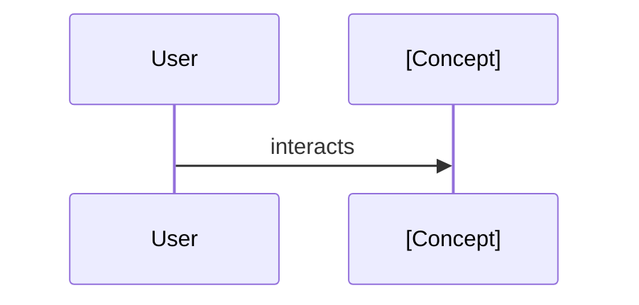

# Core Concept: [Concept Name]

## Definition
[High-level explanation of this concept. What problem does it solve?]

## Key Responsibilities
- [Responsibility 1]
- [Responsibility 2]

## Key Interfaces / Classes
The following code elements implement this concept:

- **[`ClassName`](../api-reference/module/class.md)**: The main implementation.
- **[`InterfaceName`](../api-reference/module/interface.md)**: The contract.

## Usage Pattern

## Related Concepts

- [Link to related concept]

---