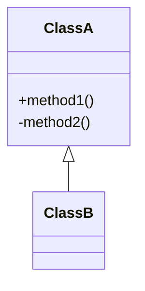

# Phase 4: Diagram Generation

**Objective**: Create Mermaid diagrams to visualize the architecture.

## Context Check
Ensure you are embedding diagrams into existing Markdown files in `docs/` (not `.docs/`).

## Diagram Types

### 1. Class Diagrams
Use the Class definitions from Phase 2 JSON to draw UML Class diagrams.

### 2. Call Graphs (Simplified)

Based on your understanding of the code (or explicit calls seen in the AST structure), draw key flow diagrams.  
Note: Since we don't have a full LSP, infer calls based on function names and context.

### 3. C4 Diagrams

- **Context**: System boundary.
    
- **Container**: High-level tech stack (DB, API, Web).
    
- **Component**: Logical modules.
    

## Action

1. Embed these diagrams directly into the Markdown files created in Phase 3.
    
2. **Context Stats**: After modifying files, report the change in file size (e.g., "Added 50 lines of Mermaid code").

---