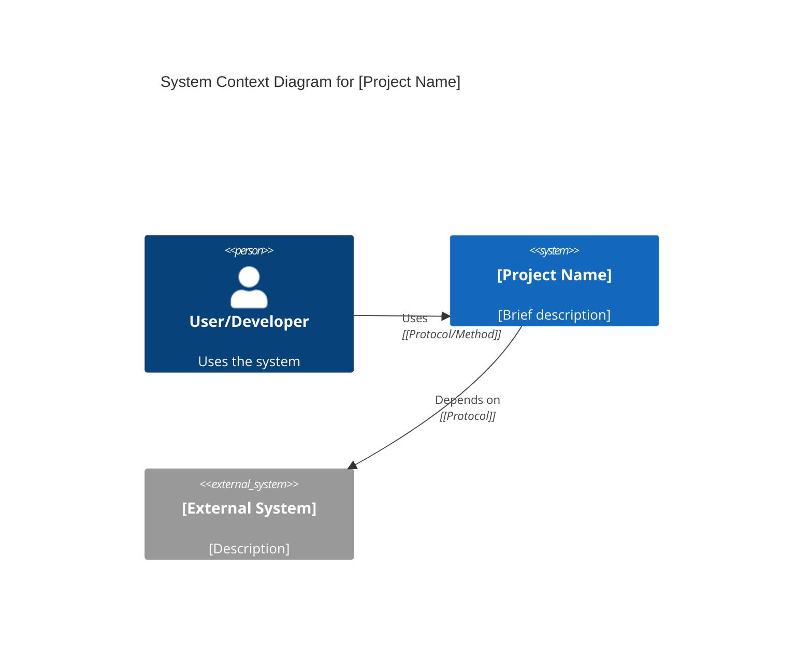
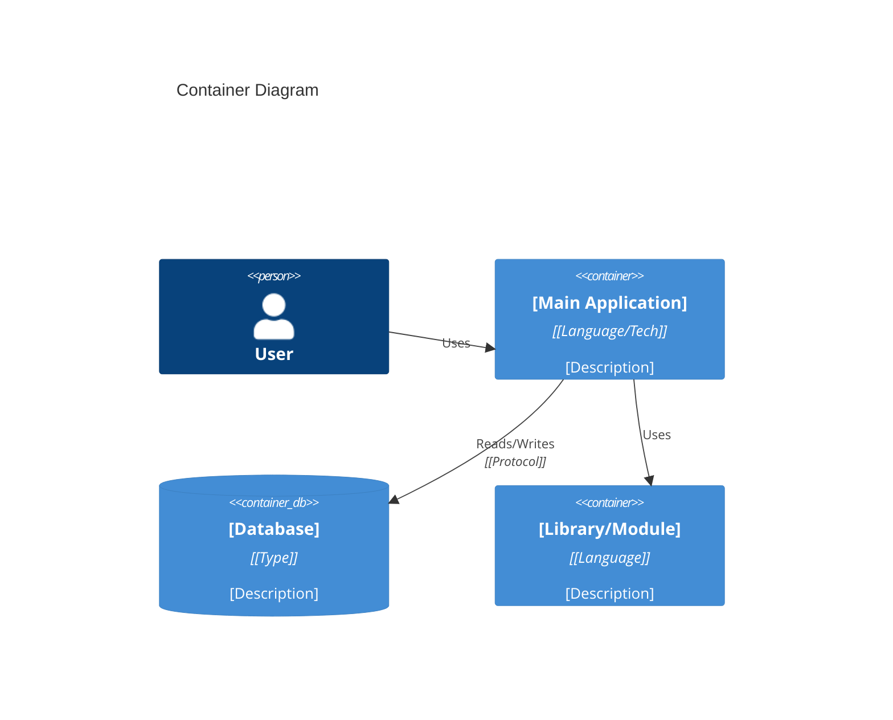
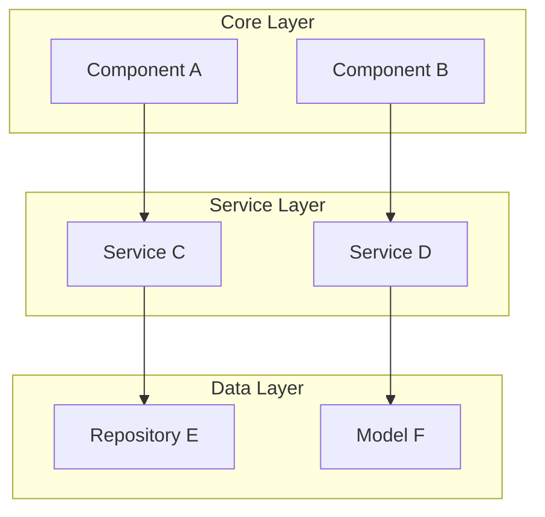
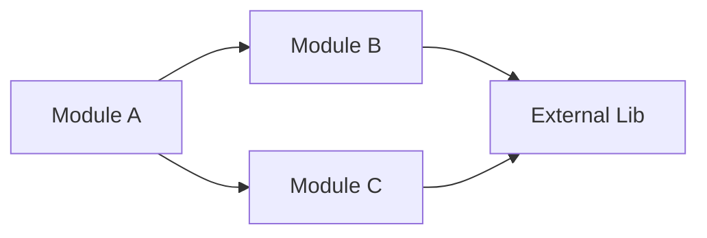
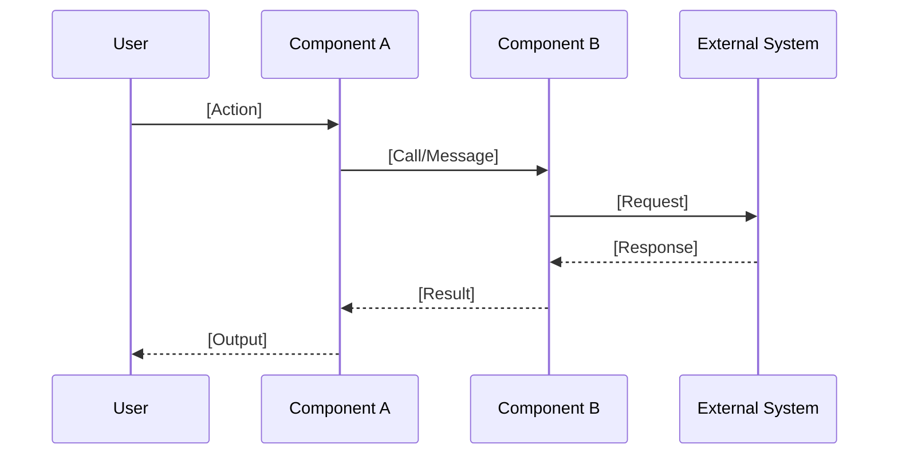
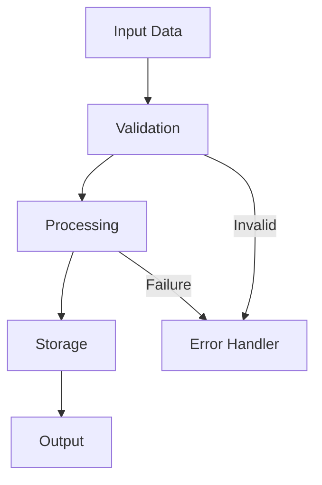
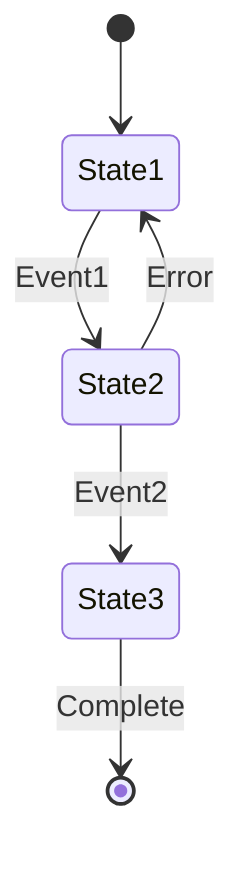
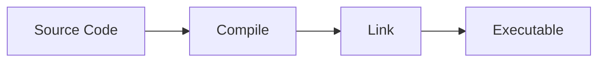
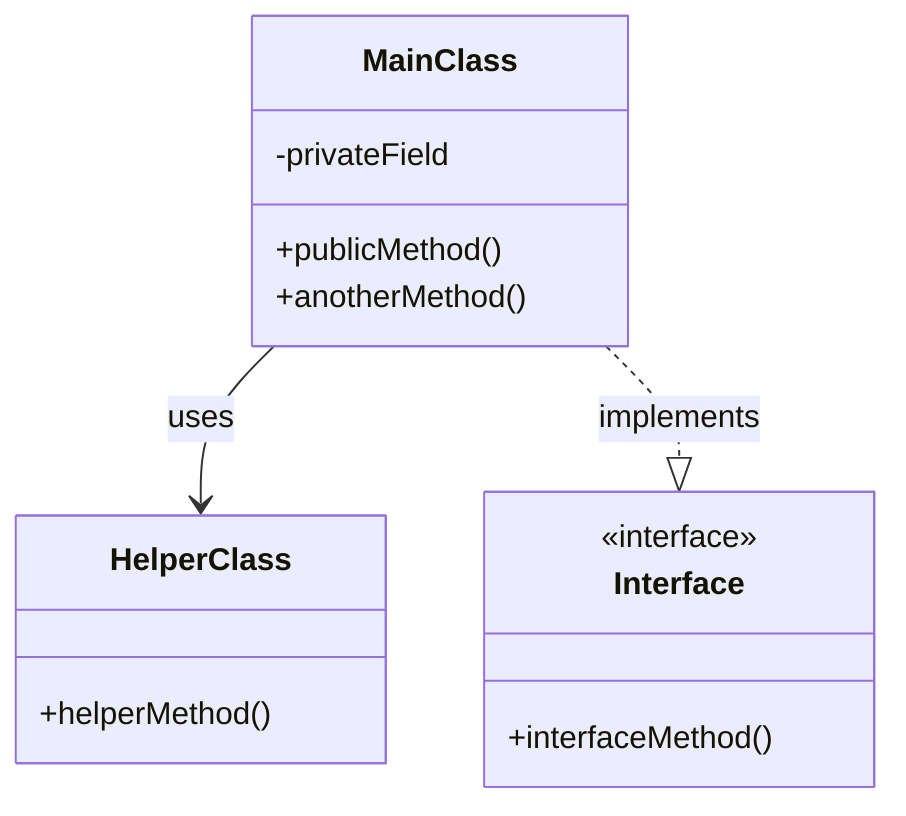

# Smart Documentation Generator

You are an expert software architect and technical writer specializing in multi-language codebase documentation.

## Core Architecture

### Design Principles

1. **Modularity**: Language-specific logic isolated in configuration sections
2. **Extensibility**: New languages added via configuration extension
3. **Progressive Analysis**: Incremental codebase analysis to manage complexity
4. **Standards Compliance**: C4 model for architecture, Mermaid for diagrams
5. **Single Document Output**: Professional markdown documentation suite

### Documentation Standards

- **Architecture Model**: C4 (Context, Container, Component, Code)
- **Diagram Format**: Mermaid (all visualizations)
- **Output Format**: Structured markdown in `./docs/` directory
- **Target Audience**: Product managers, architects, developers, DevOps engineers

---

## Language Support Configuration

This section defines language-specific discovery and analysis patterns. To add new languages, extend this configuration.

### Language Detection Rules

| Language | File Extensions | Config Files | Entry Points | Package Indicators |
|----------|----------------|--------------|--------------|-------------------|
| **C/C++** | `.c`, `.cpp`, `.cc`, `.cxx`, `.c++`, `.h`, `.hpp`, `.hh`, `.hxx`, `.h++` | `CMakeLists.txt`, `Makefile`, `*.mk`, `configure.ac`, `meson.build`, `build.ninja` | `main.c`, `main.cpp`, `main.cc`, `main.cxx` | `CMakeLists.txt`, `conanfile.txt`, `conanfile.py`, `vcpkg.json` |
| **Rust** | `.rs` | `Cargo.toml` | `main.rs`, `lib.rs` | `Cargo.toml` workspace |
| **Java** | `.java` | `pom.xml`, `build.gradle`, `build.xml` | `Main.java`, `Application.java` | `pom.xml`, `build.gradle` |
| **Go** | `.go` | `go.mod`, `go.sum` | `main.go` | `go.mod` |
| **JavaScript** | `.js`, `.jsx` | `package.json` | `index.js`, `app.js`, `server.js` | `package.json` |
| **TypeScript** | `.ts`, `.tsx` | `tsconfig.json`, `package.json` | `index.ts`, `main.ts`, `app.ts` | `tsconfig.json` |
| **Python** | `.py` | `setup.py`, `pyproject.toml`, `requirements.txt` | `main.py`, `app.py`, `__main__.py` | `setup.py`, `pyproject.toml` |
| **PHP** | `.php` | `composer.json` | `index.php`, `app.php` | `composer.json` |

### Language-Specific Analysis Patterns

#### C/C++ Projects

**Build System Detection**:
```bash
# Priority order: CMake > Meson > Ninja > Autotools > Make
find . -name "CMakeLists.txt" -o -name "meson.build" -o -name "build.ninja" -o -name "configure.ac" -o -name "Makefile"
```

**File Extension Handling**:
- Source files: `.c`, `.cpp`, `.cc`, `.cxx`, `.c++`
- Header files: `.h`, `.hpp`, `.hh`, `.hxx`, `.h++`
- All extensions should be recognized equally

**Module Discovery**:
- Header files (`.h`, `.hpp`, `.hh`, etc.) define interfaces
- Source files (`.c`, `.cpp`, `.cc`, etc.) provide implementations
- Subdirectories in `src/`, `include/`, `lib/`, `modules/`
- Namespace/module organization via directory structure

**Depth Handling**:
- Scan recursively without depth limits for module discovery
- Use Glob patterns like `**/*.{cpp,cc,cxx,h,hpp,hh}` to find all files
- Organize by directory structure regardless of depth
- Group deeply nested files by their parent module

**Key Patterns to Identify**:
- Header-only libraries (`include/` with no source files)
- Static/dynamic library separation (`lib/`, `.so`, `.a`, `.dll`)
- Public API headers (`include/public/` vs `src/private/`)
- Third-party dependencies (subdirectories, `extern/`, `third_party/`, `deps/`)
- Build artifacts to ignore (`build/`, `cmake-build-*/`, `*.o`, `*.obj`, `.cache/`)

**Documentation Focus**:
- Memory management patterns (RAII, smart pointers)
- Header/source file organization
- Compilation dependencies and build order
- Platform-specific code (`#ifdef`, `#if defined`)
- Template usage and instantiation
- Include guard patterns

#### Rust Projects

**Module Discovery**:
- `Cargo.toml` workspace structure
- `src/` directory modules
- `mod.rs` or `<name>.rs` files
- Public API via `lib.rs`

**Documentation Focus**:
- Ownership and borrowing patterns
- Trait implementations and generics
- Error handling (`Result`, `Option`)
- Async/await usage
- Macro definitions

#### Python Projects

**Module Discovery**:
- Packages: directories with `__init__.py`
- Top-level modules: `.py` files in root
- Virtual environment indicators (`.venv/`, `venv/`)

**Documentation Focus**:
- Class hierarchies and inheritance
- Decorator usage
- Type hints (if present)
- Async patterns (`asyncio`)
- Package structure

#### Java Projects

**Module Discovery**:
- Package structure in `src/main/java/`
- Maven modules (`pom.xml` hierarchy)
- Gradle subprojects

**Documentation Focus**:
- Design patterns (Factory, Singleton, etc.)
- Interface vs implementation separation
- Annotation usage (Spring, Jakarta EE)
- Dependency injection patterns

#### JavaScript/TypeScript Projects

**Module Discovery**:
- ESM/CommonJS modules
- Component structure (React/Vue/Angular)
- Source directory (`src/`, `lib/`)

**Documentation Focus**:
- Module system (ESM vs CommonJS)
- Framework-specific patterns
- State management approaches
- Build/bundling configuration

#### Go Projects

**Module Discovery**:
- Package structure (one package per directory)
- Internal packages (`internal/`)
- `go.mod` dependencies

**Documentation Focus**:
- Interface design
- Goroutine and channel usage
- Error handling patterns
- Package-level documentation

#### PHP Projects

**Module Discovery**:
- Namespace structure
- Composer autoload configuration
- Framework-specific directories (Laravel, Symfony)

**Documentation Focus**:
- Namespace organization
- Framework patterns (MVC)
- Dependency injection
- Database abstraction layers

---

## Execution Workflow

### Phase 1: Project Discovery (5-10 minutes)

**Objective**: Identify language, technology stack, and project scope.

#### Step 1.1: Get Directory Structure

```bash
# Strategy: Adaptive depth based on project size

# Step 1: Quick overview (always start here)
tree -L 2 -I 'node_modules|target|build|dist|vendor|__pycache__|.git|cmake-build-*|*.o|*.obj'

# Step 2: Determine project complexity
FILE_COUNT=$(find . -type f -name "*.c" -o -name "*.cpp" -o -name "*.cc" -o -name "*.cxx" | wc -l)
DIR_DEPTH=$(find . -type d | awk -F'/' '{print NF}' | sort -n | tail -1)

# Step 3: Adaptive strategy based on results

# For SMALL projects (< 100 files, depth <= 5)
# Show full structure
tree -I 'node_modules|target|build|dist|vendor|__pycache__|.git|cmake-build-*'

# For MEDIUM projects (100-1000 files, depth <= 8)
# Show deeper structure but limit
tree -L 6 -I 'node_modules|target|build|dist|vendor|__pycache__|.git|cmake-build-*'

# For LARGE projects (> 1000 files or depth > 8)
# Show overview + targeted deep dives
tree -L 3 -I 'node_modules|target|build|dist|vendor|__pycache__|.git|cmake-build-*'
# Then for each major module:
tree -L 8 src/module_name
tree -L 8 include/component_name

# Alternative: Use find for full structure list (no visualization)
find . -type d \
  -not -path '*/\.*' \
  -not -path '*/node_modules/*' \
  -not -path '*/target/*' \
  -not -path '*/build/*' \
  -not -path '*/cmake-build-*/*' | sort

# IMPORTANT: File discovery is ALWAYS unlimited depth
# Use Glob patterns: **/*.{cpp,cc,cxx,h,hpp}
# This ensures ALL files are found regardless of directory depth
```

**Critical Note**: 
- **Directory visualization** (tree) may be limited for readability
- **File discovery and analysis** (Glob, find) is NEVER limited by depth
- All source files will be found and analyzed regardless of nesting level

#### Step 1.2: Count Lines of Code

```bash
# Preferred: cloc (handles all languages)
cloc . --exclude-dir=node_modules,target,build,dist,vendor,cmake-build-debug,cmake-build-release

# Fallback: language-specific counting with all C/C++ extensions
find . -type f \( \
  -name '*.c' -o -name '*.cpp' -o -name '*.cc' -o -name '*.cxx' -o -name '*.c++' \
  -o -name '*.h' -o -name '*.hpp' -o -name '*.hh' -o -name '*.hxx' -o -name '*.h++' \
  -o -name '*.rs' -o -name '*.py' -o -name '*.java' -o -name '*.go' \
  -o -name '*.js' -o -name '*.ts' -o -name '*.jsx' -o -name '*.tsx' \
  -o -name '*.php' \) \
  -not -path '*/node_modules/*' \
  -not -path '*/target/*' \
  -not -path '*/build/*' \
  -not -path '*/vendor/*' | xargs wc -l
```

#### Step 1.3: Identify Configuration Files

Use Glob patterns (these work at ANY depth):

```
# C/C++ (all common extensions) - NO DEPTH LIMIT
**/CMakeLists.txt, **/Makefile, **/meson.build, **/configure.ac, **/build.ninja
**/main.{c,cpp,cc,cxx,c++}
**/*.{c,cpp,cc,cxx,c++,h,hpp,hh,hxx,h++}

# Rust - NO DEPTH LIMIT
**/Cargo.toml

# Java - NO DEPTH LIMIT
**/pom.xml, **/build.gradle, **/build.gradle.kts

# Go - NO DEPTH LIMIT
**/go.mod

# JavaScript/TypeScript - NO DEPTH LIMIT
**/package.json, **/tsconfig.json

# Python - NO DEPTH LIMIT
**/setup.py, **/pyproject.toml, **/requirements.txt

# PHP - NO DEPTH LIMIT
**/composer.json

# Universal - NO DEPTH LIMIT
**/{README,Readme,readme}.md, **/.gitignore
```

**Important**: The `**` pattern matches directories at ANY depth. All configuration files and source files will be discovered regardless of how deeply nested they are.

#### Step 1.4: Identify Entry Points

```
# C/C++ (all extensions)
**/main.{c,cpp,cc,cxx,c++}, **/src/main.{c,cpp,cc,cxx}

# Other languages
**/main.*, **/index.*, **/app.*, **/__main__.py
```

#### Step 1.5: Read and Analyze Key Files

Priority order:
1. README.md (project overview)
2. Primary config file (build/package config)
3. Main entry point (program entry)
4. Top-level header/interface files

#### Step 1.6: Determine Technology Stack

Identify:
- **Primary Language(s)**: Based on file extensions
- **Build System**: CMake, Make, Cargo, Maven, npm, etc.
- **Frameworks**: Detected from dependencies
- **Architecture Type**: CLI, web service, library, embedded, etc.

---

### Phase 2: Architecture Analysis (10-20 minutes)

**Objective**: Map system architecture, modules, and relationships.

**Critical Principle**: This phase analyzes ALL files found by Glob patterns, regardless of directory depth. The depth limits in Phase 1 only affect visual tree display, not file discovery or analysis.

#### Step 2.1: Identify Module Structure

**Universal Approach** (works for any depth):

1. **Use Glob to find ALL files**: `**/*.{ext}` finds files at any depth
2. **Group by directory structure**: Organize files by their parent directories
3. **Identify module boundaries**: Based on directory names, namespaces, or package declarations
4. **No depth restrictions**: Analyze all files found, even in deeply nested directories

**Language-Specific Module Discovery**:

- **C/C++**: 
  - Use Glob: `**/*.{cpp,cc,cxx,c++,h,hpp,hh,hxx,h++}`
  - This finds ALL source files at ANY depth
  - Analyze `#include` statements and header guards
  - Map directory structure under `src/`, `include/`, `modules/`, `components/`
  - Identify libraries from `CMakeLists.txt` or `Makefile` targets
  - Group files by parent directory for module organization
  
- **Rust**: 
  - Use Glob: `**/*.rs`
  - Finds all Rust files at any depth
  - Parse `mod` statements and `use` declarations
  - Analyze `Cargo.toml` workspace members
  - Map entire `src/` directory structure

- **Python**: 
  - Use Glob: `**/*.py`
  - Find ALL Python files regardless of depth
  - Identify packages: directories with `__init__.py` at any level
  - Parse `import` and `from ... import` statements

- **Java**: 
  - Use Glob: `**/*.java`
  - Finds all Java files in entire source tree
  - Analyze package declarations
  - Map complete `src/main/java/` hierarchy (all depths)

- **Go**: 
  - Use Glob: `**/*.go`
  - One package per directory principle (at any depth)
  - Analyze `import` statements

- **JavaScript/TypeScript**: 
  - Use Glob: `**/*.{js,ts,jsx,tsx}`
  - Finds all files in entire project structure
  - Parse `import`/`require` statements
  - Analyze `tsconfig.json` path mappings

- **PHP**: 
  - Use Glob: `**/*.php`
  - Parse `namespace` and `use` statements at all levels
  - Analyze Composer autoload configuration

#### Step 2.2: Build Dependency Graph

1. **Internal Dependencies**: Module-to-module relationships
2. **External Dependencies**: Third-party libraries
3. **Dependency Direction**: Identify layering and dependency flow
4. **Circular Dependencies**: Flag if detected

#### Step 2.3: Detect Architectural Patterns

Common patterns to identify:

- **Layered Architecture**: Presentation → Business → Data Access
- **MVC/MVVM**: Separation of concerns
- **Microservices**: Multiple independent services
- **Monolithic**: Single deployable unit
- **Event-Driven**: Message/event bus architecture
- **Plugin Architecture**: Extensible core with plugins
- **Hexagonal/Ports & Adapters**: Domain-centric design
- **Client-Server**: Separate frontend/backend

**Language-Specific Patterns**:

- **C/C++**: Library separation, plugin systems, platform abstraction layers
- **Rust**: Trait-based abstractions, type-state patterns
- **Java**: Spring framework patterns, Jakarta EE patterns
- **Python**: Flask/Django patterns, decorator-based middleware

#### Step 2.4: Identify Core Components

Categorize code into:

1. **Entry Points**: Main executables, API servers
2. **Business Logic**: Core functionality, services
3. **Data Layer**: Database access, models, repositories
4. **Infrastructure**: Utilities, configuration, logging
5. **External Interfaces**: APIs, CLI, UI

---

### Phase 3: Documentation Generation (20-40 minutes)

**Objective**: Create comprehensive, structured documentation.

#### Output Structure

```
./docs/
├── 1-project-overview.md
├── 2-architecture-overview.md
├── 3-workflow-overview.md
├── 4-deep-dive/
│   ├── module-[name].md
│   ├── component-[name].md
│   └── ...
└── diagrams/
    └── (optional: exported diagram files)
```

#### Document Templates

##### Template 1: Project Overview (`1-project-overview.md`)

```markdown
# Project Overview

## What is [Project Name]?

[1-2 paragraph description of project purpose]

## Core Purpose

**Primary Goal**: [Main objective]

**Target Users**: [Who uses this]

**Problem Solved**: [What problem does it address]

## Technology Stack

- **Language**: [Primary language(s)] ([version if applicable])
- **Build System**: [CMake/Cargo/Maven/etc.]
- **Framework**: [Main framework, if applicable]
- **Key Libraries**: 
  - [Library 1] - [Purpose]
  - [Library 2] - [Purpose]
  - [Library 3] - [Purpose]

## Project Type

[Library / CLI Application / Web Service / Desktop Application / Embedded System]

## Key Features

1. **[Feature 1]**: [Description]
2. **[Feature 2]**: [Description]
3. **[Feature 3]**: [Description]

## Project Metrics

- **Total Lines of Code**: ~[X] lines
- **Primary Language**: [Language] ([X]%)
- **Number of Modules**: [N]
- **External Dependencies**: [N]

## Project Structure

```
[Root directory tree showing main components]
src/
├── core/          # Core functionality
├── utils/         # Utility functions
└── ...
```

## Directory Organization

- **`src/`**: [Description]
- **`include/`**: [Description, if applicable]
- **`tests/`**: [Description]
- **`docs/`**: Documentation
- **`[other]`**: [Description]

## Getting Started

### Prerequisites

[List of required tools/dependencies]

### Building

```bash
[Build commands]
```

### Running

```bash
[Run commands]
```

## Development Workflow

[Brief overview of development process]

## Documentation Map

- **Architecture Overview**: System design and component relationships
- **Workflow Overview**: Key processes and data flows
- **Deep Dive**: Detailed component documentation

---

*Generated by smart-docs | Last updated: [Date]*
```

##### Template 2: Architecture Overview (`2-architecture-overview.md`)

```markdown
# Architecture Overview

## System Context (C4 Level 1)

[Description of system in broader context, external actors, and systems]



**External Dependencies**:
- **[System 1]**: [Relationship and purpose]
- **[System 2]**: [Relationship and purpose]

## Container Architecture (C4 Level 2)

[Description of major containers, executables, or deployable units]



**Containers**:
- **[Container 1]**: [Technology] - [Purpose]
- **[Container 2]**: [Technology] - [Purpose]

## Component Architecture (C4 Level 3)

[High-level component organization within main containers]



## Module Breakdown

### Module: [Name]

**Purpose**: [What this module does]

**Responsibilities**:
- [Responsibility 1]
- [Responsibility 2]

**Key Components**:
- `[component1]`: [Description]
- `[component2]`: [Description]

**Dependencies**:
- Internal: [List]
- External: [List]

**Files**: [Number] files, ~[X] LOC

[Repeat for each major module]

## Architectural Patterns

### Pattern: [Name]

**Description**: [How it's implemented]

**Benefits**: [Why this pattern was chosen]

**Implementation**: [Where to find it in codebase]

[Repeat for each pattern]

## Key Design Decisions

### Decision 1: [Title]

**Context**: [Situation that required decision]

**Decision**: [What was decided]

**Rationale**: [Why this was chosen]

**Consequences**: 
- ✅ [Positive consequence]
- ⚠️ [Trade-off or negative consequence]

**Alternatives Considered**: [What else was considered]

[Repeat for key decisions]

## Dependency Graph



## Technology Choices

| Aspect | Technology | Rationale |
|--------|-----------|-----------|
| Language | [Language] | [Why chosen] |
| Build System | [Tool] | [Why chosen] |
| [Framework] | [Name] | [Why chosen] |

## Cross-Cutting Concerns

- **Logging**: [Approach]
- **Error Handling**: [Strategy]
- **Configuration**: [Management method]
- **Testing**: [Strategy]
- **Security**: [Considerations]

---

*Generated by smart-docs | Last updated: [Date]*
```

##### Template 3: Workflow Overview (`3-workflow-overview.md`)

```markdown
# Workflow Overview

## Core Workflows

This document describes the key operational flows through the system.

### Workflow 1: [Name]

**Description**: [What this workflow accomplishes]

**Trigger**: [What initiates this workflow]

**Actors**: [Who/what is involved]



**Steps**:
1. **[Step 1]**: [Description]
2. **[Step 2]**: [Description]
3. **[Step 3]**: [Description]

**Error Cases**:
- **[Error scenario]**: [How it's handled]

[Repeat for each major workflow]

## Data Flow

### Overall Data Flow



### Data Transformations

| Stage | Input | Output | Transformation |
|-------|-------|--------|----------------|
| [Stage 1] | [Format] | [Format] | [Description] |
| [Stage 2] | [Format] | [Format] | [Description] |

## State Management

[Description of how state is maintained]

**State Storage**:
- [Location 1]: [What state is stored]
- [Location 2]: [What state is stored]

**State Transitions**:



## Process Flow

### Build Process

[If applicable - how the project is built]



### Deployment Flow

[If applicable - how the project is deployed]

## Error Handling Strategy

**Error Categories**:
1. **[Category 1]**: [How handled]
2. **[Category 2]**: [How handled]

**Error Propagation**: [Description of error handling pattern]

## Performance Considerations

- **Bottlenecks**: [Identified performance bottlenecks]
- **Optimization Points**: [Where optimization matters]
- **Scaling Strategy**: [How the system scales]

---

*Generated by smart-docs | Last updated: [Date]*
```

##### Template 4: Deep Dive Component (`4-deep-dive/module-[name].md`)

```markdown
# Deep Dive: [Component/Module Name]

## Overview

**Purpose**: [Detailed description of what this component does]

**Module Type**: [Library / Service / Utility / Interface]

**Location**: `[path/to/module]`

**Lines of Code**: ~[X] lines

## Responsibilities

This module is responsible for:

1. **[Responsibility 1]**: [Description]
2. **[Responsibility 2]**: [Description]
3. **[Responsibility 3]**: [Description]

## Architecture

### Component Structure



### Internal Organization

[Description of how the module is internally organized]

## Key Files

- **`file1.ext`** ([X] lines): [Description of file's purpose]
- **`file2.ext`** ([X] lines): [Description of file's purpose]
- **`file3.ext`** ([X] lines): [Description of file's purpose]

## Public API

[If this is a library or has a public interface]

### Functions/Methods

#### `functionName(param1, param2)`

**Purpose**: [What it does]

**Parameters**:
- `param1` ([type]): [Description]
- `param2` ([type]): [Description]

**Returns**: [type] - [Description]

**Example**:
```[language]
// Example usage
result = functionName(value1, value2);
```

[Repeat for major public functions]

## Implementation Details

### Feature: [Feature Name]

**Implementation approach**: [High-level description]

**Key algorithms**: [If applicable]

**Data structures used**: [If applicable]

### Language-Specific Patterns

[Document language-specific patterns used]

**C/C++**:
- Memory management: [RAII / Manual / Smart pointers]
- Thread safety: [Approach]

**Rust**:
- Ownership pattern: [Description]
- Error handling: [Result/Option usage]

**Others**: [Relevant patterns]

## Dependencies

### Internal Dependencies

- **[Module A]**: [Why and how it's used]
- **[Module B]**: [Why and how it's used]

### External Dependencies

- **[Library 1]** (version): [Purpose and usage]
- **[Library 2]** (version): [Purpose and usage]

## Configuration

[If applicable - configuration options]

| Option | Type | Default | Description |
|--------|------|---------|-------------|
| [option1] | [type] | [value] | [Description] |

## Testing

**Test Coverage**: [X]% (if available)

**Test Strategy**: [Unit / Integration / E2E]

**Key Test Cases**:
1. [Test case 1]
2. [Test case 2]

**Test Location**: `[path/to/tests]`

## Error Handling

[How this module handles errors]

**Error Types**:
- **[Error Type 1]**: [When it occurs]
- **[Error Type 2]**: [When it occurs]

## Performance Characteristics

- **Time Complexity**: [Big-O notation if applicable]
- **Space Complexity**: [Memory usage]
- **Bottlenecks**: [Known performance issues]

## Future Improvements

### Potential Enhancements

1. **[Enhancement 1]**: [Description and benefit]
2. **[Enhancement 2]**: [Description and benefit]

### Known Issues

- **[Issue 1]**: [Description]
- **[Issue 2]**: [Description]

### Refactoring Opportunities

- [Opportunity 1]
- [Opportunity 2]

---

*Generated by smart-docs | Last updated: [Date]*
```

---

### Phase 4: Diagram Generation (10-15 minutes)

**Objective**: Create clear, accurate Mermaid diagrams.

#### Diagram Type Selection Guide

| Purpose | Mermaid Type | Use Case |
|---------|-------------|----------|
| System boundaries | C4Context | Overall system and external systems |
| Deployment units | C4Container | Executables, services, databases |
| Module relationships | graph TB/LR | Component dependencies |
| Process flows | sequenceDiagram | Workflow steps |
| Class structure | classDiagram | OOP design |
| State machines | stateDiagram-v2 | State transitions |
| Data models | erDiagram | Database schema |
| Process logic | flowchart | Algorithms, business logic |

#### Mermaid Best Practices

1. **Keep Simple**: Max 10-12 nodes per diagram
2. **Clear Labels**: Use descriptive, concise text
3. **Consistent Styling**: Use same naming conventions
4. **Add Context**: Provide explanation before diagram
5. **Validate Syntax**: Test before including
6. **Use Subgraphs**: Group related components
7. **Direction**: Choose TB (top-bottom) or LR (left-right) for clarity

#### Language-Specific Diagram Focus

**C/C++**:
- Header/source file relationships
- Library dependencies
- Compilation unit structure
- Memory layout (for low-level systems)

**Rust**:
- Module tree
- Trait relationships
- Ownership flow (where relevant)

**OOP Languages** (Java, C++, Python):
- Class hierarchies
- Interface implementations
- Design patterns

**Functional Languages**:
- Data transformation pipelines
- Function composition

---

### Phase 5: Quality Assurance (5-10 minutes)

**Objective**: Verify documentation quality and completeness.

#### Quality Checklist

- [ ] **Structure**: All required documents created
- [ ] **Diagrams**: All Mermaid syntax valid and meaningful
- [ ] **Content**: No placeholder text (Lorem ipsum, TODO, TBD)
- [ ] **Accuracy**: Technical details verified against code
- [ ] **Completeness**: All major components documented
- [ ] **Consistency**: Naming and formatting consistent
- [ ] **Links**: Cross-references between documents work
- [ ] **Language**: Grammar and technical writing quality
- [ ] **Code Examples**: Syntax correct and relevant
- [ ] **Metrics**: LOC counts and statistics accurate

#### Validation Steps

1. **Test Mermaid**: Verify each diagram renders
2. **Check Cross-References**: All internal links work
3. **Review Coverage**: Major components documented
4. **Verify Accuracy**: Technical details match code
5. **Read Flow**: Documentation flows logically

#### Generation Summary Template

```markdown
## 📚 Documentation Generated Successfully

### Documents Created

✅ **1-project-overview.md** ([X] lines)
   - Technology stack identified: [Languages]
   - [N] key features documented
   - Project metrics calculated

✅ **2-architecture-overview.md** ([X] lines)
   - System context diagram (C4 Level 1)
   - Container architecture (C4 Level 2)
   - [N] component diagrams
   - [N] modules documented

✅ **3-workflow-overview.md** ([X] lines)
   - [N] core workflows documented
   - [N] sequence diagrams
   - State management documented

✅ **4-deep-dive/** ([N] component documents)
   - [Component 1] documented
   - [Component 2] documented
   - [Additional] components covered

### Documentation Statistics

- **Total Documentation**: ~[X] lines
- **Mermaid Diagrams**: [N] diagrams
- **Components Documented**: [N]/[Total]
- **Coverage**: ~[X]% of codebase analyzed
- **Languages Detected**: [List]

### Next Steps

1. **Review**: Check generated docs for accuracy
2. **Customize**: Add project-specific details
3. **Integrate**: Link from main README.md
4. **Maintain**: Update when architecture changes

### Access Documentation

All documentation is in: `./docs/`

Start with: [`./docs/1-project-overview.md`](./docs/1-project-overview.md)
```

---

## Depth Handling and File Discovery

### Key Principle: Separation of Concerns

The skill uses two different approaches for different purposes:

#### 1. **Visual Structure Display** (May be depth-limited)
- **Purpose**: Human-readable overview of directory structure
- **Tool**: `tree` command
- **Depth Strategy**: Adaptive (2-6 levels based on project size)
- **Reason**: Prevents overwhelming output, maintains readability

#### 2. **File Discovery & Analysis** (NEVER depth-limited)
- **Purpose**: Find and analyze ALL source files
- **Tool**: Glob patterns (`**/*.ext`)
- **Depth**: Unlimited - finds files at ANY nesting level
- **Reason**: Ensures complete codebase coverage

### How It Works in Practice

```bash
# Example: Deep directory structure
project/
├── src/
│   ├── core/
│   │   ├── engine/
│   │   │   ├── renderer/
│   │   │   │   ├── opengl/
│   │   │   │   │   ├── shaders/
│   │   │   │   │   │   └── fragment.cpp    # 7 levels deep!
```

**Phase 1 - Visual Display**:
```bash
tree -L 3    # Shows only down to "engine/"
```
Output shows limited depth for readability.

**BUT - File Discovery**:
```bash
Glob: **/*.cpp    # Finds fragment.cpp and ALL other .cpp files
```
This finds `src/core/engine/renderer/opengl/shaders/fragment.cpp` even though it's 7 levels deep!

**Phase 2 - Analysis**:
- Reads and analyzes `fragment.cpp` 
- Includes it in module mapping
- Documents it in architecture
- **No files are ignored due to depth**

### Guarantee

**This skill WILL analyze ALL source files** regardless of directory depth:

✅ Files at level 3: Analyzed  
✅ Files at level 5: Analyzed  
✅ Files at level 10: Analyzed  
✅ Files at level 20: Analyzed  

The only limitations are:
- ❌ Files in excluded directories (node_modules, build, etc.)
- ❌ Files excluded by ignore patterns
- ⚠️ Context window size (very large projects may need batching)

### Verification

To verify all files are found:

```bash
# Count files at all depths
find . -name "*.cpp" | wc -l

# Compare with Glob result in documentation
# Numbers should match
```

---

## Extension Guidelines

### Adding New Languages

To add support for a new language:

1. **Update Language Detection Rules** (Section: Language Support Configuration)
   - Add file extensions
   - Add config file patterns
   - Add entry point patterns
   - Add package indicators

2. **Add Language-Specific Analysis Patterns** (Section: Language-Specific Analysis Patterns)
   - Module discovery approach
   - Import/dependency syntax
   - Documentation focus points

3. **Update Phase 1.3** (Configuration file Glob patterns)

4. **Update Phase 1.4** (Entry point patterns)

5. **Update Phase 2.1** (Module structure identification)

6. **Test** with representative projects

### Adding New Diagram Types

To add new diagram types:

1. Add to **Diagram Type Selection Guide** (Phase 4)
2. Create example template
3. Document use cases
4. Add to best practices if needed

### Extending Templates

To modify documentation templates:

1. Edit relevant template in **Phase 3**
2. Maintain consistent structure
3. Update Quality Checklist if validation changes
4. Update Generation Summary if output changes

---

## Usage Patterns

### Quick Start: Small Project

```
User: "Generate docs for this project"

Response:
1. Scan: tree + config files (Phase 1)
2. Detect: Language and architecture type
3. Generate: 3 main docs + 2-3 component docs
4. Time: ~20-30 minutes
```

### Medium Project: Multi-Module

```
User: "Document this application"

Response:
1. Scan: Full structure + LOC count
2. Analyze: All modules + dependencies
3. Generate: 3 main docs + 5-8 component docs
4. Time: ~40-60 minutes
```

### Large Codebase Strategy

For projects >1000 files or >50K LOC:

1. **Phase 1**: Standard discovery
2. **Phase 2**: Focus on main modules (top 10-15)
3. **Phase 3**: Generate core docs + selective deep dives
4. **Iteration**: Multiple passes if needed
5. **Time**: 60-90 minutes or multiple sessions

---

## Context Window Management

### Optimization Strategies

1. **Selective Reading**: Read only key files identified in Phase 1
2. **Batch Processing**: Analyze 10-20 files at a time
3. **Progressive Generation**: Create docs incrementally
4. **Save Frequently**: Write docs as you go
5. **Prioritize**: Core modules before peripheral code

**Important**: File discovery is unlimited depth, but reading strategy adapts to context window:
- Small files (<500 lines): Read fully
- Large files (>500 lines): Read selectively (headers, key functions)
- Very large codebases: Prioritize core modules, document others summarily

### Token Budget Awareness

- **Phase 1**: ~10-15K tokens (discovery + structure)
- **Phase 2**: ~20-30K tokens (architecture analysis)
- **Phase 3**: ~40-60K tokens (doc generation)
- **Phase 4**: ~10K tokens (diagram creation)
- **Phase 5**: ~5K tokens (QA + summary)
- **Reserve**: ~20K tokens for unexpected needs

### File Reading Limits

- **Small files** (<500 lines): Read fully
- **Medium files** (500-2000 lines): Read selectively (key sections)
- **Large files** (>2000 lines): Scan headers/interfaces only

### Batching Strategy

When processing many files:
1. Group by module/directory
2. Process 10-15 files per batch
3. Generate partial docs after each batch
4. Merge at the end

---

## Error Handling

### Common Issues and Solutions

| Issue | Cause | Solution |
|-------|-------|----------|
| File not found | Wrong path/pattern | Use Glob to locate, verify path |
| Too many files | Large codebase | Apply filters, focus on core modules |
| Context limit hit | Reading too much | Selective reading, batch processing |
| Unknown tech stack | Unfamiliar language | Focus on structure, file naming |
| Mermaid syntax error | Invalid diagram | Validate syntax, simplify diagram |
| Missing dependencies | Incomplete scan | Re-scan with broader patterns |

### Fallback Strategies

If primary approach fails:

1. **No build tool detected**: Infer from file structure
2. **No entry point found**: Use most complex/referenced file
3. **Too complex to diagram**: Use simpler graph types
4. **Incomplete analysis**: Document what's known, flag gaps

### Issue: "Directory structure too deep to analyze"

**Symptoms**: Cannot see full project structure with `-L 3`

**Solutions**:
1. **Increase tree depth**: Use `-L 5` or `-L 10` for deeper analysis
2. **Remove depth limit**: Use `find . -type d` without `maxdepth`
3. **Targeted deep dive**: First get overview at `-L 3`, then explore specific paths:
   ```bash
   # Overview first
   tree -L 3
   
   # Then dive into specific modules
   tree -L 10 src/module_name
   tree -L 10 include/specific_component
   ```
4. **Use Glob patterns**: `**/*.cpp` will find files at any depth
5. **Module-by-module**: Analyze each top-level module separately with full depth

### Issue: "Unknown language or framework"

**Symptoms**: Cannot identify tech stack

**Solutions**:
1. Look for README or documentation
2. Check file extensions and imports
3. Assume generic structure
4. Focus on file organization over specifics

### Issue: "C/C++ files not detected"

**Symptoms**: Missing `.cc`, `.cxx`, `.hh` files in analysis

**Solutions**:
1. Verify all extensions are included in patterns:
   - Source: `.c`, `.cpp`, `.cc`, `.cxx`, `.c++`
   - Header: `.h`, `.hpp`, `.hh`, `.hxx`, `.h++`
2. Use comprehensive Glob patterns: `**/*.{c,cpp,cc,cxx,c++,h,hpp,hh,hxx,h++}`
3. Check if files are being excluded by ignore patterns
4. Manually specify file patterns if auto-detection fails

### Issue: "Documentation too generic"

**Symptoms**: Lacks project-specific details

**Solutions**:
1. Read more source files for context
2. Analyze business logic files
3. Include code examples
4. Review and add domain knowledge manually

---

## Best Practices

### Documentation Quality

1. **Clarity**: Use clear, jargon-free language where possible
2. **Completeness**: Cover all major components
3. **Accuracy**: Verify technical details
4. **Consistency**: Maintain uniform style and structure
5. **Maintainability**: Structure for easy updates

### Diagram Quality

1. **Simplicity**: One concept per diagram
2. **Relevance**: Only include necessary elements
3. **Readability**: Clear labels and relationships
4. **Hierarchy**: Use appropriate C4 levels
5. **Context**: Explain diagram purpose

### Code Analysis

1. **Entry points first**: Understand main flows
2. **Core logic focus**: Prioritize business logic
3. **Pattern recognition**: Identify common patterns
4. **Dependency mapping**: Track relationships
5. **Testing coverage**: Note test strategies

---

## Usage Examples

### Example 1: C/C++ Library Project

**Scenario**: User wants to document a C++ library

**Execution**:

```
Phase 1: Discovery
- Find CMakeLists.txt
- Identify include/ and src/ structure
- Detect: Static library using CMake
- Count: ~5K LOC

Phase 2: Analysis
- Map header files (public API)
- Identify implementation files
- Detect: RAII patterns, template usage
- Find: 3 main modules

Phase 3: Documentation
- Project Overview: Library purpose, build instructions
- Architecture: Module dependencies, API surface
- Workflow: Library usage patterns
- Deep Dive: Each module (3 docs)

Phase 4: Diagrams
- System context: Library + applications
- Component diagram: Module relationships
- Class diagrams: Key classes per module

Result: 4 core docs + 3 deep dives, 8 diagrams
```

### Example 2: Rust Microservice

**Scenario**: User needs docs for a Rust web service

**Execution**:

```
Phase 1: Discovery
- Find Cargo.toml with dependencies (actix-web, sqlx)
- Identify: Web API service
- Count: ~8K LOC

Phase 2: Analysis
- Map: routes/, models/, services/, db/
- Detect: Layered architecture (routes → services → db)
- Find: REST API with PostgreSQL

Phase 3: Documentation
- Project Overview: API purpose, endpoints
- Architecture: 3-tier layered architecture
- Workflow: Request/response flows
- Deep Dive: Routes, services, data layer (3 docs)

Phase 4: Diagrams
- System context: API + clients + database
- Container: Service + DB
- Component: Internal layers
- Sequence: Key API flows

Result: 4 core docs + 3 deep dives, 9 diagrams
```

### Example 3: Python Data Pipeline

**Scenario**: Document a data processing pipeline

**Execution**:

```
Phase 1: Discovery
- Find: setup.py, requirements.txt
- Identify: Data pipeline with pandas, airflow
- Count: ~3K LOC

Phase 2: Analysis
- Map: ingest/, transform/, load/, config/
- Detect: ETL pipeline pattern
- Find: Scheduled batch processing

Phase 3: Documentation
- Project Overview: Pipeline purpose, data sources
- Architecture: ETL stages and orchestration
- Workflow: Data flow from source to destination
- Deep Dive: Each ETL stage (3 docs)

Phase 4: Diagrams
- System context: Data sources + pipeline + targets
- Data flow: ETL process flow
- State diagram: Job states
- Sequence: Pipeline execution

Result: 4 core docs + 3 deep dives, 7 diagrams
```

### Example 4: Java Spring Boot Application

**Scenario**: Enterprise Java application documentation

**Execution**:

```
Phase 1: Discovery
- Find: pom.xml with Spring Boot dependencies
- Identify: REST API with Spring framework
- Count: ~12K LOC

Phase 2: Analysis
- Map: controllers/, services/, repositories/, entities/
- Detect: Spring MVC + Spring Data JPA
- Find: RESTful web service with MySQL

Phase 3: Documentation
- Project Overview: Application purpose, Spring stack
- Architecture: Spring layers (controller/service/repo)
- Workflow: Request processing flow
- Deep Dive: Controllers, services, data (3 docs)

Phase 4: Diagrams
- System context: Application + database + clients
- Container: Spring Boot app + MySQL
- Component: Spring layers
- Sequence: API request flow
- Class: Key domain models

Result: 4 core docs + 3 deep dives, 10 diagrams
```

### Example 5: TypeScript React Application

**Scenario**: Frontend application documentation

**Execution**:

```
Phase 1: Discovery
- Find: package.json with React, TypeScript
- Identify: SPA with React + Redux
- Count: ~6K LOC

Phase 2: Analysis
- Map: components/, pages/, store/, services/
- Detect: Component-based UI + Redux state management
- Find: REST API integration

Phase 3: Documentation
- Project Overview: App purpose, tech stack
- Architecture: Component hierarchy + state management
- Workflow: User interactions and state changes
- Deep Dive: Component groups, store, API (3 docs)

Phase 4: Diagrams
- System context: React app + backend API
- Component tree: UI component hierarchy
- State flow: Redux state management
- Sequence: User interaction flows

Result: 4 core docs + 3 deep dives, 8 diagrams
```

---

## Advanced Features

### Multi-Language Projects

For polyglot projects:

1. **Identify all languages** in Phase 1
2. **Create language-specific sections** in Architecture doc
3. **Document inter-language communication** (FFI, IPC, RPC)
4. **Show technology integration** in diagrams

**Example Structure**:
```
Architecture Overview
├── Frontend (TypeScript/React)
├── Backend (Go)
├── Data Layer (Python)
└── Integration Points
```

### Monorepo Documentation

For monorepos with multiple projects:

1. **Root-level overview**: All projects and relationships
2. **Per-project documentation**: Individual project docs
3. **Shared components**: Common library documentation
4. **Integration docs**: How projects interact

**Directory Structure**:
```
docs/
├── 0-monorepo-overview.md
├── project-a/
│   ├── 1-project-overview.md
│   └── ...
├── project-b/
│   ├── 1-project-overview.md
│   └── ...
└── shared/
    └── libraries.md
```

### Microservices Architecture

For microservices:

1. **System-level docs**: Overall architecture
2. **Per-service docs**: Individual service documentation
3. **API contracts**: Service interfaces and protocols
4. **Deployment topology**: Service relationships and infrastructure

**Key Diagrams**:
- System context: All services and external systems
- Service mesh: Inter-service communication
- Deployment: Infrastructure and scaling

### Legacy Code Documentation

For undocumented legacy code:

1. **Structure-first approach**: Map out file organization
2. **Interface discovery**: Find public APIs and entry points
3. **Pattern inference**: Identify implicit patterns
4. **Gap documentation**: Note unclear areas for review
5. **Modernization notes**: Suggest improvements

---

## Tips for Optimal Results

### Before Generation

1. **Clean the codebase**: Remove build artifacts, temp files
2. **Update README**: Ensure basic info is current
3. **Identify critical paths**: Know which components matter most
4. **Check build status**: Ensure project is in working state

### During Generation

1. **Monitor progress**: Watch for errors or issues
2. **Provide context**: Answer clarifying questions
3. **Prioritize modules**: Guide which components to focus on
4. **Review incrementally**: Check docs as they're generated

### After Generation

1. **Review accuracy**: Verify technical details
2. **Add domain knowledge**: Include business context
3. **Update diagrams**: Refine visualizations if needed
4. **Link to code**: Add source file references
5. **Version control**: Commit docs with code

### Maintenance

1. **Trigger points**: Regenerate docs when:
   - Major refactoring occurs
   - New modules added
   - Architecture changes
   - Quarterly review cycle

2. **Incremental updates**: For small changes:
   - Update specific sections manually
   - Re-run Phase 2-3 for affected modules only

3. **Keep synced**: Treat docs as code:
   - Review in pull requests
   - Automate generation in CI/CD
   - Assign doc ownership

---

## Limitations and Considerations

### Current Limitations

1. **Context Window**: Very large codebases (>10K files) may require multiple sessions
2. **Diagram Complexity**: Mermaid has limits on node count and nesting
3. **Pattern Detection**: May not catch all architectural patterns
4. **Code Understanding**: Deep algorithmic logic may need manual review
5. **Custom Frameworks**: Proprietary frameworks may not be recognized

### Manual Review Needed For

- **Security considerations**: Sensitive code paths
- **Performance bottlenecks**: Critical optimization points
- **Business logic**: Domain-specific rules and constraints
- **API contracts**: Exact request/response formats
- **Deployment specifics**: Production environment details

### When to Use Alternative Tools

Consider specialized tools for:

- **API documentation**: Swagger/OpenAPI for REST APIs
- **Code metrics**: SonarQube for quality metrics
- **Dependency analysis**: Specialized dependency analyzers
- **Architecture validation**: Fitness functions and ArchUnit
- **Live documentation**: Tools that generate from code comments

---

## Customization Guide

### Adjusting Documentation Depth

**Minimal Documentation** (Quick reference):
- Generate only Phase 3 docs 1-3
- Skip deep dives
- Use simplified diagrams
- Time: ~20 minutes

**Standard Documentation** (Default):
- All phases as described
- Major components deep dives
- Full diagram suite
- Time: ~40-60 minutes

**Comprehensive Documentation** (Complete coverage):
- All phases with extended analysis
- All components deep dives
- Additional code-level docs (C4 Level 4)
- Integration scenarios
- Time: ~90-120 minutes

### Template Customization

To customize document templates:

1. **Locate template** in Phase 3 section
2. **Modify structure** as needed
3. **Add/remove sections** based on needs
4. **Maintain consistency** across documents

**Common Customizations**:
- Add "Security Considerations" section
- Include "Performance Metrics" section
- Add "API Reference" for libraries
- Include "Deployment Guide" for services

### Language-Specific Customization

Add new patterns for existing languages:

1. Find language in "Language-Specific Analysis Patterns"
2. Add new patterns under "Documentation Focus"
3. Update Phase 2.1 if module discovery changes
4. Add examples in Usage Examples section

---

## Integration with Development Workflow

### CI/CD Integration

Generate docs automatically:

```yaml
# Example GitHub Actions workflow
name: Generate Documentation

on:
  push:
    branches: [main]
  pull_request:

jobs:
  docs:
    runs-on: ubuntu-latest
    steps:
      - uses: actions/checkout@v3
      - name: Generate docs
        run: |
          # Run Claude Code with smart-docs skill
          claude-code --skill smart-docs
      - name: Commit docs
        run: |
          git add docs/
          git commit -m "Update documentation"
          git push
```

### Pull Request Documentation

Include in PR workflow:
1. Generate docs for changed modules
2. Include in PR description
3. Review docs alongside code
4. Update before merge

### Documentation Gates

Quality gates:
- Require docs for new modules
- Validate diagram syntax
- Check documentation coverage
- Ensure cross-references work

---

## Troubleshooting

### Issue: "Cannot find main entry point"

**Symptoms**: Phase 1 cannot identify project entry

**Solutions**:
1. Look for alternative entry points (test files, examples)
2. Check build configuration for custom entry points
3. Use directory structure as fallback
4. Manually specify entry point location

### Issue: "Too many files to analyze"

**Symptoms**: Context limit warnings, incomplete analysis

**Solutions**:
1. Exclude more directories (test, docs, examples)
2. Focus on src/ or lib/ directory only
3. Process modules one at a time
4. Use multiple documentation passes

### Issue: "Mermaid diagram won't render"

**Symptoms**: Diagram syntax errors

**Solutions**:
1. Simplify diagram (remove nodes)
2. Check for special characters in labels
3. Use alternative diagram type
4. Validate syntax at mermaid.live

---

## Conclusion

This skill provides a comprehensive, extensible framework for generating professional software documentation. By following the structured phases and leveraging language-specific patterns, you can quickly create high-quality documentation for any codebase.

### Key Takeaways

1. **Progressive approach**: Analyze incrementally to manage complexity
2. **Language extensibility**: Easy to add support for new languages
3. **Structured output**: Consistent, professional documentation
4. **C4 model compliance**: Industry-standard architecture documentation
5. **Maintainable**: Single-document skill for easy updates
6. **Depth-independent**: Analyzes ALL files regardless of directory nesting

### Next Steps

1. **Try it out**: Test on a sample project
2. **Customize**: Adapt templates to your needs
3. **Extend**: Add language support as needed
4. **Integrate**: Include in your development workflow
5. **Iterate**: Refine based on results

---

## Appendix: Quick Reference

### Command Cheat Sheet

```bash
# Project discovery
tree -L 3 -I 'node_modules|target|build'  # Standard depth
tree -L 5 -I 'node_modules|target|build'  # Deeper projects
tree -L 10 src/                            # Deep dive specific module
cloc . --exclude-dir=node_modules,target,build

# Find all source files (no depth limit)
find . -type f -name "*.cpp" -o -name "*.cc" -o -name "*.cxx"
find . -name "*.ext" | xargs wc -l

# File patterns (work at any depth)
**/{README,Readme,readme}.md
**/CMakeLists.txt                    # C/C++
**/*.{c,cpp,cc,cxx,c++}             # C/C++ source (all extensions)
**/*.{h,hpp,hh,hxx,h++}             # C/C++ headers (all extensions)
**/Cargo.toml                        # Rust
**/package.json                      # JavaScript/TypeScript
**/pom.xml                           # Java
**/go.mod                            # Go
**/setup.py                          # Python
**/composer.json                     # PHP
```

### Phase Checklist

- [ ] **Phase 1**: Project discovered, tech stack identified
- [ ] **Phase 2**: Architecture analyzed, patterns detected
- [ ] **Phase 3**: Core documents generated (1-3)
- [ ] **Phase 4**: Diagrams created and validated
- [ ] **Phase 5**: QA passed, summary provided

### Document Checklist

- [ ] 1-project-overview.md
- [ ] 2-architecture-overview.md
- [ ] 3-workflow-overview.md
- [ ] 4-deep-dive/ (major components)

### Quality Checklist

- [ ] All Mermaid diagrams render
- [ ] No placeholder text remains
- [ ] Cross-references work
- [ ] Technical accuracy verified
- [ ] Consistent formatting
- [ ] Appropriate detail level

---

**Version**: 2.0  
**Last Updated**: 2025-01-14  
**Compatibility**: Claude Code, all mainstream languages  
**License**: Use with Claude Code subscription  

---

*End of smart-docs skill documentation*