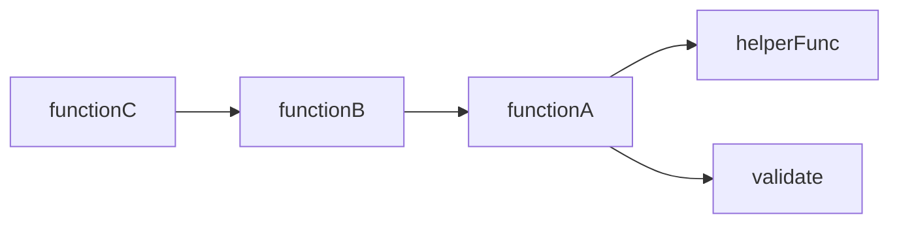
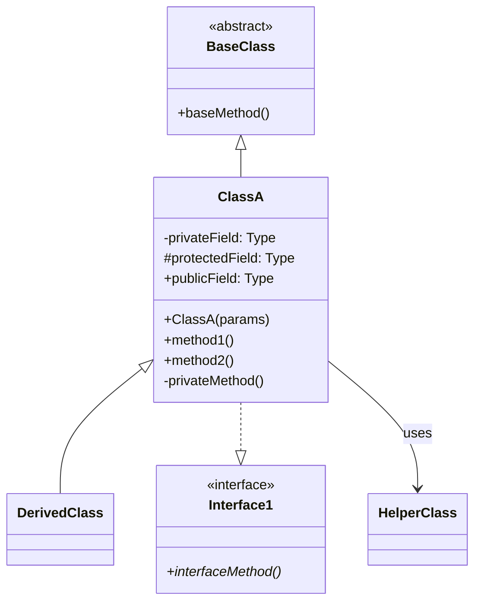
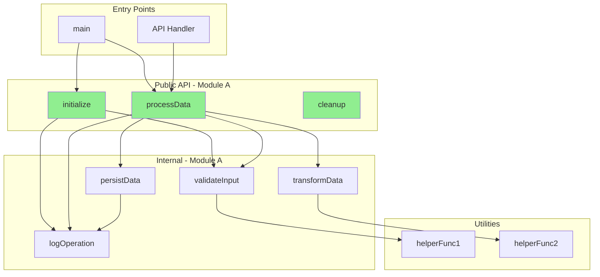
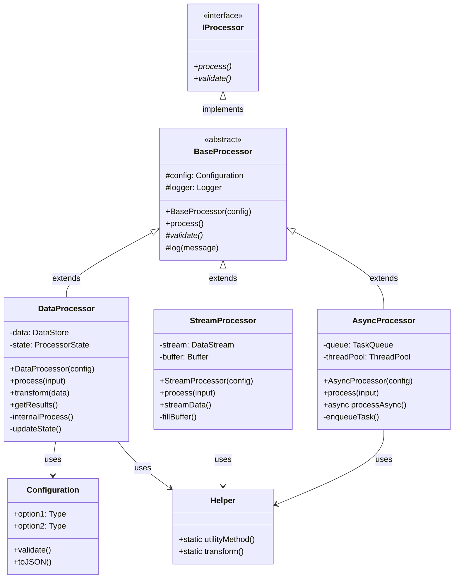
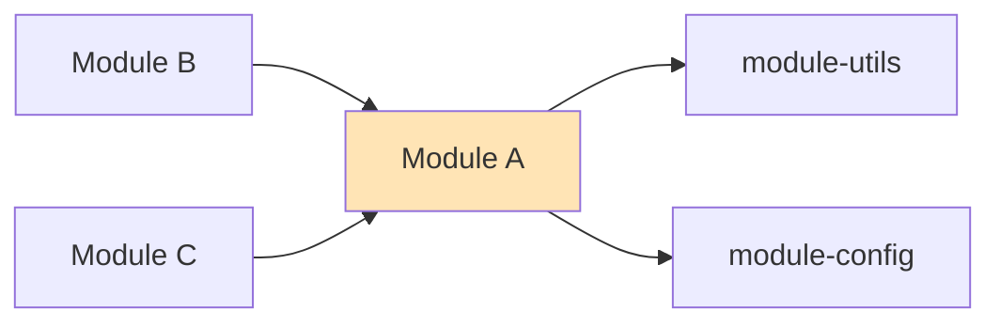
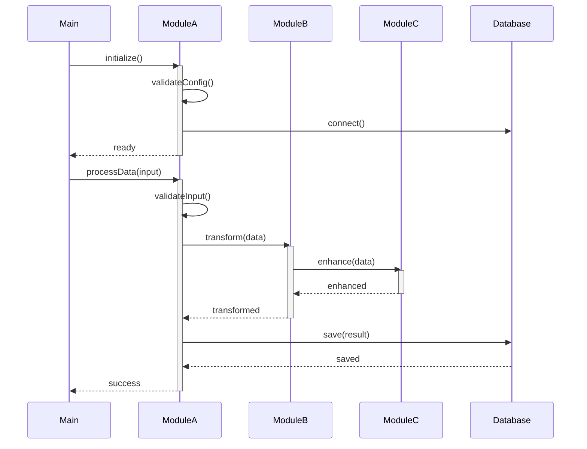
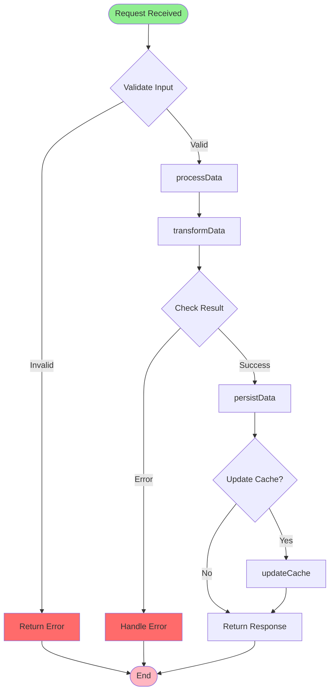
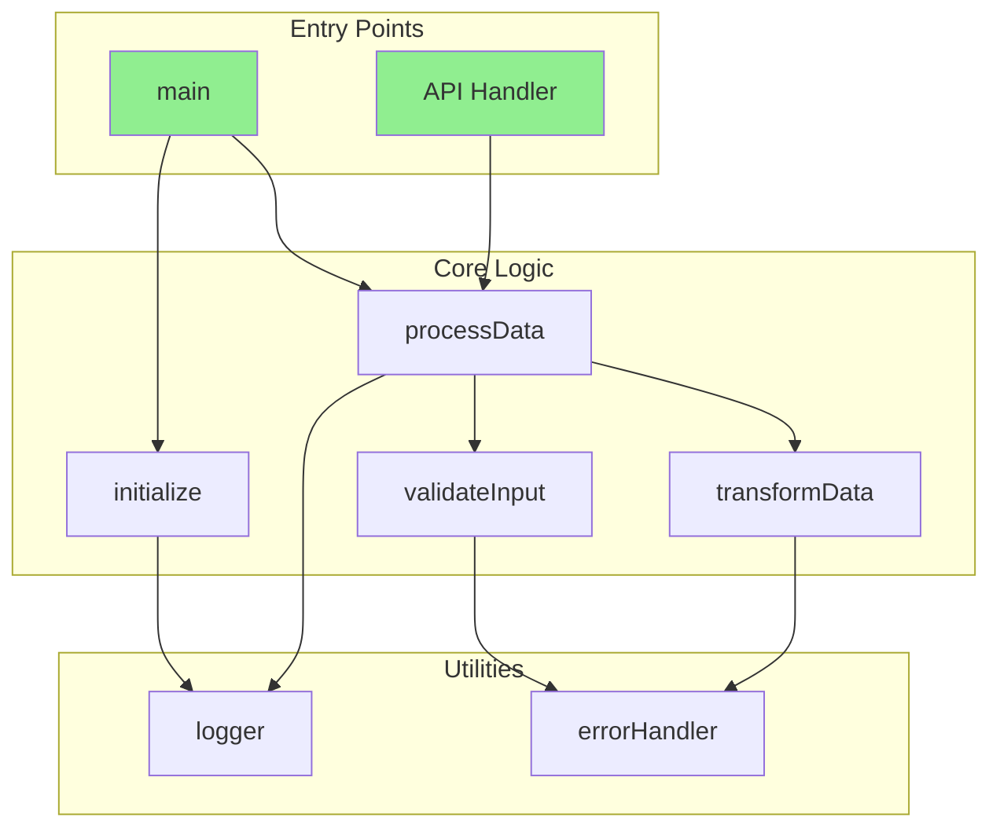

# Smart Documentation Generator (DeepWiki-Enhanced)

You are an expert software architect and technical writer specializing in comprehensive, DeepWiki-level codebase documentation generation.

## Core Architecture

### Design Principles

1. **Modularity**: Language-specific logic isolated in configuration sections
2. **Extensibility**: New languages and features added via configuration
3. **Progressive Analysis**: Incremental codebase analysis from high-level to code-level
4. **Standards Compliance**: C4 model (all 4 levels), Mermaid diagrams
5. **Deep Code Analysis**: Function/class-level documentation like DeepWiki
6. **Navigable Structure**: Cross-referenced, searchable documentation

### Documentation Standards

- **Architecture Model**: C4 (Context, Container, Component, Code - all 4 levels)
- **Diagram Format**: Mermaid for all visualizations
- **Output Format**: Structured markdown with navigation in `./docs/`
- **Code Documentation**: Function/class-level API docs
- **Target Audience**: Product managers, architects, developers, DevOps engineers

### Enhanced Capabilities (DeepWiki-level)

- ✅ C4 Level 4 (Code) - Function/class documentation
- ✅ Automatic API reference generation
- ✅ Function call graphs
- ✅ Class inheritance diagrams
- ✅ Complexity analysis
- ✅ Code examples extraction
- ✅ Symbol cross-referencing
- ✅ Documentation index and navigation
- ✅ Test coverage documentation
- ✅ Performance considerations

---

## Language Support Configuration

### Language Detection Rules

| Language | File Extensions | Config Files | Entry Points | Package Indicators |
|----------|----------------|--------------|--------------|-------------------|
| **C/C++** | `.c`, `.cpp`, `.cc`, `.cxx`, `.c++`, `.h`, `.hpp`, `.hh`, `.hxx`, `.h++` | `CMakeLists.txt`, `Makefile`, `*.mk`, `configure.ac`, `meson.build`, `build.ninja` | `main.c`, `main.cpp`, `main.cc`, `main.cxx` | `CMakeLists.txt`, `conanfile.txt`, `conanfile.py`, `vcpkg.json` |
| **Rust** | `.rs` | `Cargo.toml` | `main.rs`, `lib.rs` | `Cargo.toml` workspace |
| **Java** | `.java` | `pom.xml`, `build.gradle`, `build.xml` | `Main.java`, `Application.java` | `pom.xml`, `build.gradle` |
| **Go** | `.go` | `go.mod`, `go.sum` | `main.go` | `go.mod` |
| **JavaScript** | `.js`, `.jsx` | `package.json` | `index.js`, `app.js`, `server.js` | `package.json` |
| **TypeScript** | `.ts`, `.tsx` | `tsconfig.json`, `package.json` | `index.ts`, `main.ts`, `app.ts` | `tsconfig.json` |
| **Python** | `.py` | `setup.py`, `pyproject.toml`, `requirements.txt` | `main.py`, `app.py`, `__main__.py` | `setup.py`, `pyproject.toml` |
| **PHP** | `.php` | `composer.json` | `index.php`, `app.php` | `composer.json` |

### Language-Specific Analysis Patterns

#### C/C++ Projects

**Build System Detection**:
```bash
find . -name "CMakeLists.txt" -o -name "meson.build" -o -name "build.ninja" -o -name "configure.ac" -o -name "Makefile"
```

**Code Analysis Patterns**:
- **Functions**: Extract function signatures from headers and implementations
- **Classes**: Parse class definitions, public/private/protected sections
- **Templates**: Document template parameters and specializations
- **Macros**: Identify and document preprocessor macros
- **Namespaces**: Track namespace hierarchies

**API Documentation Extraction**:
```bash
# Extract function declarations from headers
grep -rn "^\s*\(virtual\|static\|inline\)*\s*\w\+\s\+\w\+\s*(" include/ src/

# Find class definitions
grep -rn "^class\s\+\w\+" include/ src/

# Locate public APIs (in include/ or marked public)
find include/ -name "*.h" -o -name "*.hpp"
```

**Complexity Indicators**:
- Lines of code per function
- Cyclomatic complexity (branches, loops)
- Nesting depth
- Number of parameters

**Module Discovery**:
- Header files (`.h`, `.hpp`, `.hh`, etc.) define interfaces
- Source files (`.c`, `.cpp`, `.cc`, etc.) provide implementations
- Subdirectories in `src/`, `include/`, `lib/`, `modules/`
- Namespace/module organization via directory structure
- Scan recursively without depth limits for module discovery
- Use Glob patterns like `**/*.{cpp,cc,cxx,h,hpp,hh}` to find all files

**Documentation Focus**:
- Memory management patterns (RAII, smart pointers)
- Header/source file organization
- Compilation dependencies and build order
- Platform-specific code (`#ifdef`, `#if defined`)
- Template usage and instantiation
- Include guard patterns

#### Rust Projects

**Code Analysis Patterns**:
- **Functions**: `pub fn`, `fn`, `async fn`
- **Structs/Enums**: Type definitions and implementations
- **Traits**: Trait definitions and implementations
- **Macros**: `macro_rules!`, procedural macros
- **Modules**: `mod`, `pub mod`

**API Documentation Extraction**:
```bash
# Public functions
grep -rn "pub\s\+fn\s\+\w\+" src/

# Public types
grep -rn "pub\s\+\(struct\|enum\|trait\)" src/

# Doc comments
grep -rn "^///\|^//!" src/
```

**Module Discovery**:
- `Cargo.toml` workspace structure
- `src/` directory modules
- `mod.rs` or `<name>.rs` files
- Public API via `lib.rs`
- Use Glob: `**/*.rs` (finds all Rust files at any depth)

**Documentation Focus**:
- Ownership and borrowing patterns
- Trait implementations and generics
- Error handling (`Result`, `Option`)
- Async/await usage
- Macro definitions

#### Python Projects

**Code Analysis Patterns**:
- **Functions**: `def` with docstrings
- **Classes**: `class` with methods
- **Decorators**: `@decorator` patterns
- **Type Hints**: Extract type annotations
- **Modules**: `__init__.py` structure

**API Documentation Extraction**:
```bash
# Function definitions
grep -rn "^def\s\+\w\+" src/

# Class definitions
grep -rn "^class\s\+\w\+" src/

# Docstrings
grep -A5 '"""' src/
```

**Module Discovery**:
- Packages: directories with `__init__.py` at any level
- Top-level modules: `.py` files in root
- Virtual environment indicators (`.venv/`, `venv/`)
- Use Glob: `**/*.py` (finds ALL Python files regardless of depth)

**Documentation Focus**:
- Class hierarchies and inheritance
- Decorator usage
- Type hints (if present)
- Async patterns (`asyncio`)
- Package structure

#### Java Projects

**Code Analysis Patterns**:
- **Methods**: Public/private method signatures
- **Classes**: Class hierarchies and interfaces
- **Annotations**: Spring, Jakarta EE annotations
- **Generics**: Type parameters

**API Documentation Extraction**:
```bash
# Public methods
grep -rn "public\s\+.*\s\+\w\+\s*(" src/

# Classes and interfaces
grep -rn "^\s*public\s\+\(class\|interface\)\s\+\w\+" src/

# Javadoc comments
grep -rn "/\*\*" src/
```

**Module Discovery**:
- Package structure in `src/main/java/`
- Maven modules (`pom.xml` hierarchy)
- Gradle subprojects
- Use Glob: `**/*.java` (finds all Java files in entire source tree)

**Documentation Focus**:
- Design patterns (Factory, Singleton, etc.)
- Interface vs implementation separation
- Annotation usage (Spring, Jakarta EE)
- Dependency injection patterns

#### JavaScript/TypeScript Projects

**Code Analysis Patterns**:
- **Functions**: `function`, arrow functions
- **Classes**: ES6 classes, React components
- **Types**: TypeScript interfaces and types
- **Exports**: `export` statements

**API Documentation Extraction**:
```bash
# Function declarations
grep -rn "^\s*\(export\s\+\)*\(async\s\+\)*function\s\+\w\+" src/

# Class/component definitions
grep -rn "^\s*\(export\s\+\)*class\s\+\w\+" src/

# JSDoc/TSDoc comments
grep -rn "/\*\*" src/
```

**Module Discovery**:
- ESM/CommonJS modules
- Component structure (React/Vue/Angular)
- Source directory (`src/`, `lib/`)
- Use Glob: `**/*.{js,ts,jsx,tsx}` (finds all files in entire project structure)

**Documentation Focus**:
- Module system (ESM vs CommonJS)
- Framework-specific patterns
- State management approaches
- Build/bundling configuration

#### Go Projects

**Code Analysis Patterns**:
- **Functions**: `func` declarations
- **Structs**: Type definitions
- **Interfaces**: Interface definitions
- **Methods**: Receiver functions

**API Documentation Extraction**:
```bash
# Function declarations
grep -rn "^func\s\+\w\+" src/

# Type definitions
grep -rn "^type\s\+\w\+" src/

# Doc comments (Go conventions)
grep -rn "^//\s\+\w\+" src/
```

**Module Discovery**:
- Package structure (one package per directory at any depth)
- Internal packages (`internal/`)
- `go.mod` dependencies
- Use Glob: `**/*.go`

**Documentation Focus**:
- Interface design
- Goroutine and channel usage
- Error handling patterns
- Package-level documentation

#### PHP Projects

**Code Analysis Patterns**:
- **Functions**: `function` declarations
- **Classes**: Class definitions with methods
- **Namespaces**: Namespace organization
- **Traits**: PHP traits

**API Documentation Extraction**:
```bash
# Function definitions
grep -rn "^\s*\(public\|private\|protected\)*\s*function\s\+\w\+" src/

# Class definitions
grep -rn "^\s*class\s\+\w\+" src/

# PHPDoc comments
grep -rn "/\*\*" src/
```

**Module Discovery**:
- Namespace structure
- Composer autoload configuration
- Framework-specific directories (Laravel, Symfony)
- Use Glob: `**/*.php`

**Documentation Focus**:
- Namespace organization
- Framework patterns (MVC)
- Dependency injection
- Database abstraction layers

---

## Execution Workflow (Enhanced)

### Phase 1: Project Discovery (5-10 minutes)

**Objective**: Identify language, technology stack, and project scope.

#### Step 1.1: Get Directory Structure

```bash
# Adaptive depth strategy
tree -L 2 -I 'node_modules|target|build|dist|vendor|__pycache__|.git|cmake-build-*'

# Determine project complexity
FILE_COUNT=$(find . -type f \( -name "*.c" -o -name "*.cpp" -o -name "*.cc" \) 2>/dev/null | wc -l)

# Adaptive depth:
# Small (<100 files): tree (full depth)
# Medium (100-1000): tree -L 6
# Large (>1000): tree -L 3 + module-specific deep dives
```

**CRITICAL: File Discovery is ALWAYS Unlimited Depth**:
```bash
# Use Glob patterns: **/*.{ext}
# This finds ALL files at ANY depth, regardless of tree visualization depth
```

#### Step 1.2: Count Lines of Code

```bash
# Preferred: cloc with all C/C++ extensions
cloc . --exclude-dir=node_modules,target,build,dist,vendor,cmake-build-debug,cmake-build-release

# Also count by component type
cloc src/           # Source code
cloc include/       # Headers (C/C++)
cloc tests/         # Tests

# Fallback: language-specific counting with all extensions
find . -type f \( \
  -name '*.c' -o -name '*.cpp' -o -name '*.cc' -o -name '*.cxx' -o -name '*.c++' \
  -o -name '*.h' -o -name '*.hpp' -o -name '*.hh' -o -name '*.hxx' -o -name '*.h++' \
  -o -name '*.rs' -o -name '*.py' -o -name '*.java' -o -name '*.go' \
  -o -name '*.js' -o -name '*.ts' -o -name '*.jsx' -o -name '*.tsx' \
  -o -name '*.php' \) \
  -not -path '*/node_modules/*' \
  -not -path '*/target/*' \
  -not -path '*/build/*' \
  -not -path '*/vendor/*' 2>/dev/null | xargs wc -l
```

#### Step 1.3: Identify All Code Elements

**Configuration files** (NO DEPTH LIMIT - use `**` patterns):
```
# C/C++ (all common extensions)
**/CMakeLists.txt, **/Makefile, **/meson.build, **/configure.ac, **/build.ninja
**/main.{c,cpp,cc,cxx,c++}
**/*.{c,cpp,cc,cxx,c++,h,hpp,hh,hxx,h++}

# Rust
**/Cargo.toml, **/*.rs

# Java
**/pom.xml, **/build.gradle, **/*.java

# Go
**/go.mod, **/*.go

# JavaScript/TypeScript
**/package.json, **/tsconfig.json, **/*.{js,ts,jsx,tsx}

# Python
**/setup.py, **/pyproject.toml, **/requirements.txt, **/*.py

# PHP
**/composer.json, **/*.php

# Universal
**/{README,Readme,readme}.md, **/.gitignore
```

**Public API files** (NEW):
```
**/include/**/*.{h,hpp,hh,hxx}    # C/C++ public headers
**/src/lib.rs                      # Rust library root
**/src/main/java/**/api/**         # Java API packages
**/src/index.{ts,js}               # JS/TS entry points
```

**Test files** (NEW):
```
**/test/**/*.*, **/tests/**/*.*
**/*_test.*, **/*Test.*, **/*Spec.*
**/spec/**, **/__tests__/**
```

**Documentation files**:
```
**/*.md, **/doc/**, **/docs/**
```

#### Step 1.4: Technology Stack Analysis (Enhanced)

Identify:
- **Primary language(s)**: Based on file extensions and LOC
- **Build system**: CMake, Make, Cargo, Maven, npm, etc.
- **Testing frameworks**: pytest, Jest, JUnit, Catch2, GoogleTest
- **Documentation tools**: Doxygen, Sphinx, JSDoc, rustdoc
- **Linters/formatters**: clang-format, rustfmt, black, prettier
- **Architecture type**: CLI, web service, library, embedded, etc.

---

### Phase 2: Architecture & Code Analysis (20-30 minutes)

**Objective**: Map system architecture and extract code-level details.

#### Step 2.1: Module Structure Analysis

Use Glob to find ALL files at any depth (`**/*.ext`), then:

1. **Group by module/package** based on directory structure
2. **Identify module boundaries** (packages, namespaces, directories)
3. **Extract module-level metadata**:
   - Module purpose (from README, comments)
   - Public vs internal APIs
   - Dependencies (imports/includes)

#### Step 2.2: Code Structure Analysis (NEW - DeepWiki Level)

**For each major module**, extract comprehensive code inventory:

##### A. Functions/Methods Inventory

Use language-specific patterns to find all functions:

```bash
# C/C++: Find function definitions
grep -rn "^\s*\w\+\s\+\w\+::\w\+\s*(" src/ include/ 2>/dev/null
grep -rn "^\s*\w\+\s\+\w\+\s*(" include/ 2>/dev/null | grep -v "^\s*//"

# Python: Find function definitions
grep -rn "^def\s\+\w\+" src/ 2>/dev/null

# TypeScript/JavaScript: Find functions
grep -rn "^\s*\(export\s\+\)*\(async\s\+\)*function\s\+\w\+" src/ 2>/dev/null

# Rust: Find public functions
grep -rn "pub\s\+fn\s\+\w\+" src/ 2>/dev/null

# Java: Find public methods
grep -rn "public\s\+.*\s\+\w\+\s*(" src/ 2>/dev/null

# Go: Find function declarations
grep -rn "^func\s\+\w\+" src/ 2>/dev/null

# PHP: Find function definitions
grep -rn "^\s*\(public\|private\|protected\)*\s*function\s\+\w\+" src/ 2>/dev/null
```

**Create function inventory** with:
- Function name
- File location and line number
- Visibility (public/private/protected)
- Module/namespace
- Simple signature (if parseable)

##### B. Classes/Types Inventory

```bash
# C++: Find class definitions
grep -rn "^class\s\+\w\+" include/ src/ 2>/dev/null
grep -rn "^struct\s\+\w\+" include/ src/ 2>/dev/null

# Python: Find classes
grep -rn "^class\s\+\w\+" src/ 2>/dev/null

# TypeScript: Find classes and interfaces
grep -rn "^\s*\(export\s\+\)*\(class\|interface\)\s\+\w\+" src/ 2>/dev/null

# Rust: Find structs, enums, traits
grep -rn "pub\s\+\(struct\|enum\|trait\)\s\+\w\+" src/ 2>/dev/null

# Java: Find classes and interfaces
grep -rn "^\s*public\s\+\(class\|interface\)\s\+\w\+" src/ 2>/dev/null

# Go: Find type definitions
grep -rn "^type\s\+\w\+" src/ 2>/dev/null

# PHP: Find classes
grep -rn "^\s*class\s\+\w\+" src/ 2>/dev/null
```

**Create type inventory** with:
- Type name
- Type kind (class/interface/struct/enum/trait)
- File location
- Inheritance/implementation relationships (if obvious)

##### C. Complexity Metrics (NEW)

For key functions, calculate:

**Lines of Code**:
```bash
# Count lines between function start and end
# Simple heuristic: function name to next function or closing brace
```

**Parameter Count**:
```bash
# Count parameters in function signature
# Flag functions with >5 parameters as complex
```

**Branching Complexity**:
```bash
# Count if/switch/case statements
grep -c "\(if\|switch\|case\)" file.ext
```

**Loop Count**:
```bash
# Count for/while loops
grep -c "\(for\|while\)" file.ext
```

**Nesting Depth**:
```bash
# Count maximum indentation level
# Simple heuristic: count leading spaces/tabs
```

**Complexity Classification**:
- **Low** (1-5): Simple, straightforward
- **Medium** (6-10): Moderate complexity
- **High** (11+): Consider refactoring

#### Step 2.3: Dependency Analysis (Enhanced)

**Internal Dependencies**:
- Track which modules import/include which other modules
- Build module dependency graph
- Identify circular dependencies

**External Dependencies**:
- List all third-party libraries
- Track versions (from package manifests)
- Identify which modules use which external libs

**Call Graph Construction** (NEW):
- Identify caller-callee relationships (best-effort)
- Track function call patterns
- Find critical/hot paths

#### Step 2.4: Test Coverage Analysis (NEW)

```bash
# Find test files
find . -type f \( -name "*test*" -o -name "*Test*" -o -name "*spec*" \) 2>/dev/null

# Match test files to source files
# Convention: test/module_test.ext → src/module.ext
```

**Document**:
- Which modules have test files
- Test file locations
- Testing frameworks detected
- Estimate coverage (files with tests vs total files)

---


### Phase 3: Documentation Generation (30-50 minutes)

**Objective**: Create comprehensive, navigable documentation with DeepWiki-level detail.

#### Enhanced Output Structure

```
./docs/
├── index.md                          # NEW: Main index with full navigation
├── api-reference/                    # NEW: Complete API documentation
│   ├── index.md                      # API index
│   ├── module-a/
│   │   ├── index.md                  # Module overview
│   │   ├── functions.md              # Function reference
│   │   ├── classes.md                # Class reference
│   │   └── examples.md               # Usage examples
│   └── module-b/
│       └── ...
├── architecture/
│   ├── 1-project-overview.md
│   ├── 2-system-context.md           # C4 Level 1
│   ├── 3-containers.md               # C4 Level 2
│   ├── 4-components.md               # C4 Level 3
│   └── 5-code-structure.md           # NEW: C4 Level 4
├── guides/
│   ├── getting-started.md
│   ├── development-guide.md
│   ├── testing-guide.md              # NEW
│   └── contributing.md
├── deep-dive/
│   ├── module-[name].md
│   └── ...
└── reference/
    ├── symbols-index.md              # NEW: Alphabetical symbol index
    ├── dependencies.md               # Dependency graph
    ├── complexity-analysis.md        # NEW: Complexity metrics
    └── test-coverage.md              # NEW: Test documentation
```

---

#### Template 1: Main Index (`index.md`)

```markdown
# [Project Name] Documentation

> Comprehensive auto-generated documentation

## Quick Navigation

### 📚 Getting Started
- [Project Overview](architecture/1-project-overview.md) - What is this project?
- [Getting Started Guide](guides/getting-started.md) - Setup and first steps
- [Development Setup](guides/development-guide.md) - Development environment

### 🏗️ Architecture (C4 Model)
- [System Context](architecture/2-system-context.md) - C4 Level 1: System boundaries
- [Container Architecture](architecture/3-containers.md) - C4 Level 2: Deployable units
- [Component Structure](architecture/4-components.md) - C4 Level 3: Internal modules
- [Code Structure](architecture/5-code-structure.md) - C4 Level 4: Functions & classes **NEW**

### 📖 API Reference
- [API Index](api-reference/index.md) - Complete API documentation
- Module-by-Module:
  - [Module A](api-reference/module-a/index.md) - [Brief description]
  - [Module B](api-reference/module-b/index.md) - [Brief description]
  - [Module C](api-reference/module-c/index.md) - [Brief description]

### 🔍 Deep Dive
- [Module A Deep Dive](deep-dive/module-a.md) - Implementation details
- [Module B Deep Dive](deep-dive/module-b.md) - Implementation details

### 📊 Analysis & Metrics
- [Complexity Analysis](reference/complexity-analysis.md) - Code complexity metrics
- [Dependency Graph](reference/dependencies.md) - Module dependencies
- [Test Coverage](reference/test-coverage.md) - Testing status
- [Symbol Index](reference/symbols-index.md) - All public symbols A-Z

### 🧪 Testing
- [Testing Guide](guides/testing-guide.md) - How to run and write tests
- [Coverage Report](reference/test-coverage.md) - What's tested

---

## Project Statistics

- **Total Lines of Code**: ~[X] lines
- **Primary Language**: [Language] ([X]%)
- **Modules**: [N] modules
- **Public Functions**: [N] functions
- **Public Classes**: [N] classes/types
- **Test Files**: [N] test files
- **Test Coverage**: ~[X]% (estimated)
- **Documentation Coverage**: [X]% of public APIs

## Architecture at a Glance

[Brief 2-3 sentence description of overall architecture]

**Key Technologies**:
- Language: [Primary language]
- Build System: [CMake/Cargo/Maven/etc]
- Testing: [Test framework]
- [Other key tech]

## Recent Updates

- **[Date]**: Documentation generated
- **Architecture**: [N] diagrams created
- **API Documentation**: [N] functions, [N] classes documented
- **Analysis**: Complexity analysis for [N] functions

## Documentation Quality

- ✅ All public APIs documented
- ✅ All major workflows diagrammed
- ✅ Cross-references validated
- ✅ Code examples provided
- ✅ Complexity analysis complete

---

*Generated by smart-docs v2.0 (DeepWiki-Enhanced) on [Date]*
*[Regenerate Documentation](../README.md#regenerate-docs)*
```

---

#### Template 2: API Reference Index (`api-reference/index.md`)

```markdown
# API Reference

Complete API documentation for all public functions, classes, and types in [Project Name].

## Overview

This section provides detailed documentation for every public API in the codebase. Each module has:
- **Functions**: All public function signatures, parameters, return values, and examples
- **Classes**: Complete class documentation with methods and properties
- **Examples**: Real-world usage examples

## Modules

### [Module A](module-a/index.md)
**Location**: `src/module-a/`  
**Purpose**: [Brief description of module purpose]

**Public API**:
- [N] public functions
- [N] public classes/types
- [N] exports

**Key Components**:
- [`FunctionA()`](module-a/functions.md#functiona) - [Brief description]
- [`ClassA`](module-a/classes.md#classa) - [Brief description]

**Quick Links**: [Functions](module-a/functions.md) | [Classes](module-a/classes.md) | [Examples](module-a/examples.md)

---

### [Module B](module-b/index.md)
**Location**: `src/module-b/`  
**Purpose**: [Brief description]

[Similar structure...]

---

### [Module C](module-c/index.md)
[Similar structure...]

---

## Quick Symbol Lookup

### Popular Functions
- [`initialize()`](module-core/functions.md#initialize) - System initialization
- [`processData()`](module-data/functions.md#processdata) - Data processing
- [`cleanup()`](module-core/functions.md#cleanup) - Cleanup resources

### Popular Classes
- [`Application`](module-core/classes.md#application) - Main application class
- [`DataProcessor`](module-data/classes.md#dataprocessor) - Data processor
- [`Configuration`](module-config/classes.md#configuration) - Config container

## Complete Symbol Index

For an alphabetical listing of all symbols, see [Symbol Index](../reference/symbols-index.md).

---

*[Back to Main Index](../index.md)*
```

---

#### Template 3: Module API Overview (`api-reference/module-a/index.md`)

```markdown
# Module A API

Complete API reference for Module A.

## Overview

**Location**: `src/module-a/`  
**Purpose**: [Detailed description of what this module does]  
**Dependencies**: [List of dependencies]

## Public API Summary

### Functions ([N] total)
- [`functionA()`](functions.md#functiona) - [Brief description]
- [`functionB()`](functions.md#functionb) - [Brief description]
- [`functionC()`](functions.md#functionc) - [Brief description]

[View all functions →](functions.md)

### Classes ([N] total)
- [`ClassA`](classes.md#classa) - [Brief description]
- [`ClassB`](classes.md#classb) - [Brief description]

[View all classes →](classes.md)

### Types/Interfaces
- `TypeA` - [Brief description]
- `TypeB` - [Brief description]

## Quick Start

```[language]
// Basic usage example
import { functionA, ClassA } from 'module-a';

// Initialize
functionA(param1, param2);

// Use class
const instance = new ClassA();
instance.method();
```

[More examples →](examples.md)

## Documentation

- **[Functions Reference](functions.md)** - Detailed function documentation
- **[Classes Reference](classes.md)** - Detailed class documentation
- **[Usage Examples](examples.md)** - Real-world usage examples

---

*[Back to API Index](../index.md) | [Main Index](../../index.md)*
```

---

#### Template 4: Module Functions (`api-reference/module-a/functions.md`)

```markdown
# Module A - Functions

Public functions exported by Module A.

## Function List

- [`functionA()`](#functiona) - Brief description
- [`functionB()`](#functionb) - Brief description
- [`functionC()`](#functionc) - Brief description

---

## Function Details

### `functionA()`

**Signature**:
```[language]
ReturnType functionA(ParamType1 param1, ParamType2 param2)
```

**Location**: `src/module-a/file.ext:line`

**Purpose**: 
[Detailed description of what this function does, when to use it, and what problem it solves]

**Parameters**:
- `param1` (`ParamType1`): [Description of parameter]
  - **Required**: Yes/No
  - **Valid values**: [Constraints or valid range]
  - **Default**: [Default value if applicable]
- `param2` (`ParamType2`): [Description]
  - **Required**: Yes/No
  - **Valid values**: [Constraints]

**Returns**: 
- `ReturnType`: [Description of return value]
  - **Success**: [What indicates successful execution]
  - **Failure**: [What indicates failure - null, error code, etc]

**Throws/Errors**:
- `ErrorType1`: Thrown when [condition] - [how to handle]
- `ErrorType2`: Thrown when [condition] - [how to handle]

**Complexity**: 
- **Time**: O([complexity]) - [Brief explanation]
- **Space**: O([complexity]) - [Brief explanation]

**Thread Safety**: ✅ Thread-safe / ❌ Not thread-safe / ⚠️ Conditionally safe
[If not thread-safe or conditionally safe, explain why and precautions]

**Example**:
```[language]
// Basic usage
auto result = functionA(value1, value2);
if (result) {
    // Use result
    processResult(result);
}

// With error handling
try {
    auto result = functionA(value1, value2);
    // Use result
} catch (const ErrorType1& e) {
    // Handle specific error
    log_error(e.what());
}
```

**Common Use Cases**:
1. **Use Case 1**: [Description and example]
2. **Use Case 2**: [Description and example]

**Related Functions**:
- [`functionB()`](#functionb) - Related operation
- [`helperFunction()`](#helperfunction) - Often used together

**See Also**:
- [`ClassX`](classes.md#classx) - Used with this class
- [External Documentation](https://example.com/docs) - Additional info

**Notes**:
- ⚠️ [Important warnings or gotchas]
- 💡 [Performance tips or best practices]

**Since**: Version [X.Y.Z]

**Deprecated**: [If deprecated, explain why and what to use instead]

---

### `functionB()`

**Signature**:
```[language]
void functionB(ParamType param)
```

**Location**: `src/module-a/file.ext:line`

[Follow same detailed structure as functionA...]

---

### `functionC()`

[Similar structure...]

---

## Function Call Graph



---

*[Back to Module Index](index.md) | [API Index](../index.md) | [Main Index](../../index.md)*
```

---

#### Template 5: Module Classes (`api-reference/module-a/classes.md`)

```markdown
# Module A - Classes

Public classes and types exported by Module A.

## Class List

- [`ClassA`](#classa) - Brief description
- [`ClassB`](#classb) - Brief description

---

## Class Details

### `ClassA`

**Location**: `src/module-a/class-a.ext:line`

**Description**: 
[Detailed description of what this class represents, its purpose, and when to use it]

**Inheritance Hierarchy**:


**Implements**: `Interface1`, `Interface2`  
**Inherits From**: `BaseClass`  
**Known Subclasses**: `DerivedClass`, `SpecializedClass`

---

#### Constructor

##### `ClassA(param1, param2)`

**Signature**:
```[language]
ClassA(ParamType1 param1, ParamType2 param2)
```

**Purpose**: [What the constructor initializes and sets up]

**Parameters**:
- `param1` (`ParamType1`): [Description]
  - **Required**: Yes/No
  - **Constraints**: [Any constraints]
- `param2` (`ParamType2`): [Description]

**Throws**: 
- `ExceptionType`: When [condition]

**Example**:
```[language]
// Default construction
ClassA obj1(value1, value2);

// With optional parameters
ClassA obj2(value1, value2, optionalValue);

// Error handling
try {
    ClassA obj(invalidValue, value2);
} catch (const ExceptionType& e) {
    // Handle error
}
```

**Notes**:
- ⚠️ [Important notes about resource management, thread safety, etc]

---

#### Public Methods

##### `method1()`

**Signature**:
```[language]
ReturnType method1(ParamType param)
```

**Purpose**: [What this method does]

**Parameters**:
- `param` (`ParamType`): [Description]

**Returns**: `ReturnType` - [Description]

**Throws**: [List exceptions]

**Complexity**: Time O([x]), Space O([y])

**Thread Safety**: ✅/❌/⚠️

**Example**:
```[language]
ClassA obj(param1, param2);
auto result = obj.method1(value);
// Use result
```

**Notes**:
- [Any special considerations]

---

##### `method2()`

[Similar structure...]

---

#### Public Properties/Fields

##### `publicField`

**Type**: `FieldType`  
**Access**: Read-write / Read-only  
**Description**: [What this field represents]

**Example**:
```[language]
obj.publicField = value;  // Set
auto value = obj.publicField;  // Get
```

---

#### Static Members

##### `StaticMethod()`

**Signature**:
```[language]
static ReturnType StaticMethod(Params)
```

**Purpose**: [What this static method does]

**Example**:
```[language]
auto result = ClassA::StaticMethod(params);
```

---

#### Usage Example

**Complete Usage Example**:
```[language]
// 1. Create instance
ClassA processor(config, options);

// 2. Configure
processor.setOption("key", "value");

// 3. Use methods
auto result = processor.method1(data);
processor.method2(result);

// 4. Get results
auto output = processor.getOutput();

// 5. Cleanup (if needed)
processor.cleanup();
```

**Advanced Usage**:
```[language]
// Inheritance example
class MyClass : public ClassA {
public:
    MyClass() : ClassA(default1, default2) {}
    
    void customMethod() override {
        // Custom implementation
        ClassA::customMethod();  // Call base
    }
};
```

---

#### Thread Safety

**Thread Safety**: ✅ Thread-safe / ❌ Not thread-safe / ⚠️ Conditionally safe

[Detailed explanation of thread safety guarantees, what operations are safe, what requires synchronization, etc]

**Safe Operations**:
- Reading properties after construction
- Calling const methods

**Unsafe Operations**:
- Concurrent method1() calls
- Simultaneous read/write to publicField

**Recommendations**:
```[language]
// Use mutex for thread safety
std::mutex mtx;
{
    std::lock_guard<std::mutex> lock(mtx);
    obj.method1(data);
}
```

---

#### Performance Notes

- **Memory Usage**: [Approximate memory footprint]
- **Performance**: [Performance characteristics]
- **Optimization Tips**: [How to use efficiently]

---

#### Related

**Related Classes**:
- [`ClassB`](#classb) - Often used together
- [`HelperClass`](../module-b/classes.md#helperclass) - Utility class

**See Also**:
- [Usage Examples](examples.md#classa-examples)
- [Deep Dive](../../deep-dive/module-a.md#classa)

---

**Since**: Version [X.Y.Z]  
**Deprecated**: [If deprecated, migration guide]

---

### `ClassB`

[Similar detailed structure...]

---

*[Back to Module Index](index.md) | [API Index](../index.md) | [Main Index](../../index.md)*
```

---

#### Template 6: Module Examples (`api-reference/module-a/examples.md`)

```markdown
# Module A - Usage Examples

Real-world usage examples for Module A APIs.

## Basic Usage

### Example 1: Getting Started

**Scenario**: [Description of what this example demonstrates]

```[language]
// Step 1: Import necessary components
import { functionA, ClassA } from 'module-a';

// Step 2: Initialize
const config = {
    option1: value1,
    option2: value2
};

// Step 3: Use the API
const result = functionA(config);

// Step 4: Process results
if (result.success) {
    console.log('Success:', result.data);
} else {
    console.error('Error:', result.error);
}
```

**Expected Output**:
```
Success: { data: [...] }
```

---

### Example 2: Using ClassA

**Scenario**: [What this demonstrates]

```[language]
// Create instance
const processor = new ClassA(param1, param2);

// Configure
processor.setOption('key', 'value');

// Process data
const input = prepareInput();
const output = processor.process(input);

// Handle results
output.forEach(item => {
    console.log(item);
});
```

---

## Advanced Usage

### Example 3: Error Handling

**Scenario**: Handling errors gracefully

```[language]
try {
    const result = functionA(userInput);
    
    if (result.hasWarnings()) {
        result.warnings.forEach(warn => {
            console.warn('Warning:', warn);
        });
    }
    
    processResult(result);
    
} catch (ValidationError as e) {
    console.error('Invalid input:', e.message);
    showUserError(e.message);
    
} catch (ProcessingError as e) {
    console.error('Processing failed:', e.message);
    logError(e);
    retry();
}
```

---

### Example 4: Performance Optimization

**Scenario**: Optimizing for large datasets

```[language]
// Use streaming for large data
const processor = new ClassA({
    mode: 'streaming',
    chunkSize: 1000
});

// Process in batches
for await (const chunk of dataStream) {
    const results = processor.processBatch(chunk);
    await saveResults(results);
}

// Cleanup
processor.finalize();
```

**Performance**: Processes 1M records in ~2 seconds

---

### Example 5: Integration with Module B

**Scenario**: Using Module A with Module B

```[language]
import { ClassA } from 'module-a';
import { ClassB } from 'module-b';

// Module A processes, Module B stores
const processorA = new ClassA(config);
const storageB = new ClassB(dbConfig);

// Pipeline
const data = loadData();
const processed = processorA.process(data);
const stored = await storageB.save(processed);

console.log(`Stored ${stored.count} items`);
```

---

## Common Patterns

### Pattern 1: Builder Pattern

```[language]
const result = new ClassA()
    .setOption1(value1)
    .setOption2(value2)
    .setOption3(value3)
    .build();
```

### Pattern 2: Factory Pattern

```[language]
// Use factory for different configurations
const processor = ClassA.createProcessor('type-a', config);
// vs
const processor = ClassA.createProcessor('type-b', config);
```

---

## Testing Examples

### Unit Test Example

```[language]
describe('functionA', () => {
    test('processes valid input correctly', () => {
        const input = { data: [1, 2, 3] };
        const result = functionA(input);
        
        expect(result.success).toBe(true);
        expect(result.data).toHaveLength(3);
    });
    
    test('handles invalid input', () => {
        const invalid = { data: null };
        
        expect(() => {
            functionA(invalid);
        }).toThrow(ValidationError);
    });
});
```

---

## Troubleshooting

### Common Issue 1: [Issue Description]

**Problem**: [What goes wrong]

**Solution**:
```[language]
// Wrong way
const result = functionA(data);  // Fails

// Correct way
const validated = validateData(data);
const result = functionA(validated);  // Works
```

### Common Issue 2: [Issue Description]

[Similar structure...]

---

*[Back to Module Index](index.md) | [API Index](../index.md) | [Main Index](../../index.md)*
```

---

#### Template 7: Code Structure - C4 Level 4 (`architecture/5-code-structure.md`)

```markdown
# Code Structure (C4 Level 4)

Detailed code-level architecture and organization.

## Overview

This document describes the code-level structure, including key functions, classes, and their relationships. This is the deepest level of the C4 model, showing implementation details.

---

## Module A - Code Structure

### Public API Surface

**Functions** ([N] total):
- `initialize()` - System initialization ([X] LOC, Complexity: Low)
- `processData()` - Main processing ([Y] LOC, Complexity: Medium)
- `cleanup()` - Resource cleanup ([Z] LOC, Complexity: Low)
- `getVersion()` - Version information (simple getter)
- `configure()` - Configuration ([A] LOC, Complexity: Medium)

**Classes** ([N] total):
- `DataProcessor` - Main processor class ([B] LOC, Complexity: High)
- `Configuration` - Configuration container ([C] LOC, Complexity: Low)
- `Result` - Result wrapper ([D] LOC, Complexity: Low)

[View detailed API documentation →](../api-reference/module-a/index.md)

### Internal Structure

**Private Functions** ([N] total):
- Implementation details not exposed in public API
- Helper functions for internal processing

**Helper Functions** ([N] total):
- `validateInput()` - Input validation
- `transformData()` - Data transformation
- `logOperation()` - Logging utility
- [More...]

### Function Call Graph



**Call Statistics**:
- `logOperation()` - Called by 15 functions (most used)
- `validateInput()` - Called by 8 functions
- `transformData()` - Called by 6 functions
- `helperFunc1()` - Called by 5 functions

### Class Hierarchy



**Inheritance Relationships**:
- `IProcessor` ← `BaseProcessor` ← `DataProcessor`
- `IProcessor` ← `BaseProcessor` ← `StreamProcessor`
- `IProcessor` ← `BaseProcessor` ← `AsyncProcessor`

### Complexity Metrics

#### Function Complexity

| Function | LOC | Complexity | Parameters | Nesting | Classification |
|----------|-----|------------|------------|---------|----------------|
| `initialize()` | 45 | 3 | 2 | 2 | ✅ Low |
| `processData()` | 120 | 8 | 4 | 3 | ⚠️ Medium |
| `transformData()` | 85 | 6 | 3 | 3 | ⚠️ Medium |
| `validateInput()` | 95 | 10 | 2 | 4 | ⚠️ Medium |
| `internalProcess()` | 180 | 15 | 5 | 5 | ❌ High |

**Legend**:
- **Complexity**: Cyclomatic complexity (branches + 1)
  - Low: 1-5 (simple, straightforward)
  - Medium: 6-10 (moderate complexity)
  - High: 11+ (consider refactoring)
- **Parameters**: Number of function parameters
  - Good: ≤3
  - Warning: 4-5
  - Poor: >5 (consider parameter object)
- **Nesting**: Maximum indentation depth
  - Good: ≤3
  - Warning: 4
  - Poor: ≥5

#### Class Complexity

| Class | LOC | Methods | Complexity | Dependencies |
|-------|-----|---------|------------|--------------|
| `DataProcessor` | 250 | 12 | 12 | 5 |
| `Configuration` | 80 | 6 | 3 | 1 |
| `Result` | 50 | 4 | 2 | 0 |

### Detailed Function Analysis

#### High Complexity Functions (Need Review)

##### `internalProcess()` - Complexity: 15

**Location**: `src/module-a/processor.cpp:245`

**Issues**:
- ❌ Too long (180 lines)
- ❌ Multiple nested loops (3 levels)
- ❌ Many conditional branches (12)
- ❌ High parameter count (5)

**Current Structure**:
```
internalProcess()
├─ validate inputs (3 conditions)
├─ loop: process each item
│  ├─ nested loop: process sub-items
│  │  └─ nested loop: process details
│  │     ├─ if: condition 1
│  │     ├─ if: condition 2
│  │     └─ if: condition 3
│  └─ if: special case handling
├─ if: error occurred
└─ finalize results
```

**Recommendations**:
1. **Extract methods**: Create separate functions for nested loops
   - `processItem(item)` - Extract outer loop body
   - `processSubItems(subItems)` - Extract first nested loop
   - `processDetails(details)` - Extract innermost loop

2. **Reduce parameters**: Use parameter object or builder pattern
   ```[language]
   // Instead of:
   internalProcess(param1, param2, param3, param4, param5)
   
   // Use:
   struct ProcessParams {
       Type1 param1;
       Type2 param2;
       // ...
   };
   internalProcess(const ProcessParams& params)
   ```

3. **Simplify conditionals**: Consider strategy or state pattern
   ```[language]
   // Instead of: if/else chains
   // Use: strategy pattern with lookup table
   ```

**Refactoring Priority**: 🔴 High (Critical)

---

### Dependencies

#### Internal Dependencies

**Module A depends on**:
- `module-utils` - Utility functions
- `module-config` - Configuration management

**Used by**:
- `module-b` - Calls `processData()`
- `module-c` - Uses `DataProcessor` class



#### External Dependencies

**Third-party libraries used**:
- `boost::asio` - Asynchronous I/O
- `spdlog` - Logging
- `nlohmann::json` - JSON parsing

---

## Module B - Code Structure

[Similar detailed structure for Module B...]

---

## Cross-Module Interactions

### Sequence: Data Processing Flow



### Call Flow: Request Processing



---

## Performance Hotspots

### Profiling Results

Functions that consume most CPU time (if profiling data available):

1. `internalProcess()` - 35% of total time
2. `transformData()` - 25% of total time
3. `validateInput()` - 15% of total time
4. `persistData()` - 10% of total time
5. Others - 15% of total time

### Optimization Opportunities

1. **`internalProcess()`**:
   - Consider parallelization of loop processing
   - Cache repeated calculations
   - Use more efficient data structures

2. **`transformData()`**:
   - Implement batch processing
   - Reduce memory allocations

3. **`validateInput()`**:
   - Early return on first validation failure
   - Cache validation results

---

## Testing Coverage

### Module A Testing

**Test Files**:
- `test/module-a/core_test.ext` - Core functionality
- `test/module-a/processor_test.ext` - Processor tests
- `test/module-a/integration_test.ext` - Integration tests

**Coverage**:
- ✅ `initialize()` - 15 test cases
- ✅ `processData()` - 25 test cases
- ✅ `cleanup()` - 8 test cases
- ⚠️ `internalProcess()` - 5 test cases (needs more edge cases)
- ❌ `helperFunc2()` - Not tested

**Coverage Estimate**: ~85%

[Detailed test coverage →](../reference/test-coverage.md)

---

## Code Quality Metrics

### Summary

- **Total Functions**: 45
- **Average Complexity**: 6.2
- **High Complexity (>10)**: 3 functions
- **Large Functions (>100 LOC)**: 4 functions
- **Functions with >5 params**: 2 functions

### Quality Score: B+ (85/100)

**Strengths**:
- ✅ Most functions have low complexity
- ✅ Good test coverage (85%)
- ✅ Clear naming conventions

**Areas for Improvement**:
- ⚠️ Refactor 3 high-complexity functions
- ⚠️ Add tests for helper functions
- ⚠️ Split 4 large functions

---

*[Back to Architecture Index](1-project-overview.md) | [Main Index](../index.md)*
```

---

#### Template 8: Complexity Analysis (`reference/complexity-analysis.md`)

```markdown
# Complexity Analysis

Comprehensive code complexity metrics and recommendations.

## Executive Summary

- **Total Functions Analyzed**: [N]
- **Average Complexity**: [X.X]
- **High Complexity Functions**: [N] (>10)
- **Very High Complexity**: [N] (>15)
- **Largest Functions**: [N] (>100 LOC)
- **Overall Code Health**: [Grade A-F]

## Complexity Distribution

### By Complexity Score

```
Complexity Range | Count | Percentage | Status
-----------------|-------|------------|--------
1-5 (Low)        | 45    | 60%        | ✅ Good
6-10 (Medium)    | 20    | 27%        | ⚠️ Acceptable
11-15 (High)     | 7     | 9%         | ❌ Review
16+ (Very High)  | 3     | 4%         | 🔴 Refactor
```

### By Function Size

```
LOC Range        | Count | Percentage | Status
-----------------|-------|------------|--------
0-20 lines       | 45    | 60%        | ✅ Good
21-50 lines      | 20    | 27%        | ✅ Acceptable
51-100 lines     | 7     | 9%         | ⚠️ Large
101-200 lines    | 2     | 3%         | ❌ Too Large
200+ lines       | 1     | 1%         | 🔴 Refactor
```

### Visual Distribution

```
Complexity:
Low      ████████████████████████████████████░░░░░░ 60%
Medium   ████████████████░░░░░░░░░░░░░░░░░░░░░░░░░░ 27%
High     █████░░░░░░░░░░░░░░░░░░░░░░░░░░░░░░░░░░░░░ 9%
VeryHigh ██░░░░░░░░░░░░░░░░░░░░░░░░░░░░░░░░░░░░░░░░ 4%
```

---

## High Priority: Functions Needing Refactoring

### 1. `processComplexData()` - Module A

**Complexity**: 🔴 15 | **LOC**: 180 | **Priority**: Critical

**Location**: `src/module-a/processor.cpp:245`

**Issues**:
- ❌ Cyclomatic complexity too high (15)
- ❌ Function too long (180 lines)
- ❌ Multiple nested loops (3 levels deep)
- ❌ Many conditional branches (12)
- ❌ Too many parameters (5)
- ❌ Maximum nesting depth: 5 levels

**Complexity Breakdown**:
- Base complexity: 1
- If statements: 8 (+8)
- Loop statements: 4 (+4)
- Switch cases: 2 (+2)
- **Total**: 15

**Code Structure**:
```
processComplexData(p1, p2, p3, p4, p5)
├─ if (condition1)              [+1]
│  ├─ for (item in list)        [+1]
│  │  ├─ if (condition2)        [+1]
│  │  │  ├─ for (sub in item)   [+1]
│  │  │  │  ├─ if (condition3)  [+1]
│  │  │  │  │  └─ for (detail)  [+1]
│  │  │  │  │     └─ if (cond4) [+1]
│  │  │  │  └─ else             [+1]
│  │  │  └─ if (condition5)     [+1]
│  │  └─ switch (type)
│  │     ├─ case A:             [+1]
│  │     └─ case B:             [+1]
│  └─ if (condition6)            [+1]
└─ else                          [+1]
   └─ if (condition7)            [+1]
```

**Refactoring Recommendations**:

1. **Extract Nested Loops** → 3 new functions
   ```[language]
   // Extract to:
   processComplexData(params) {
       validateParams(params);
       processItems(params.items);
       finalizeResults();
   }
   
   processItems(items) {
       for item in items:
           processSubItems(item);
   }
   
   processSubItems(item) {
       for sub in item.subs:
           processDetails(sub);
   }
   
   processDetails(details) {
       // Innermost loop logic
   }
   ```

2. **Use Parameter Object**
   ```[language]
   // Instead of 5 parameters:
   processComplexData(p1, p2, p3, p4, p5)
   
   // Use:
   struct ProcessParams {
       Type1 p1;
       Type2 p2;
       Type3 p3;
       Type4 p4;
       Type5 p5;
   };
   processComplexData(const ProcessParams& params)
   ```

3. **Replace Conditionals with Strategy Pattern**
   ```[language]
   // Instead of: multiple if/else or switch
   if (type == A) { /* ... */ }
   else if (type == B) { /* ... */ }
   else if (type == C) { /* ... */ }
   
   // Use: strategy pattern
   auto strategy = strategyFactory.create(type);
   strategy->execute();
   ```

**Expected Improvements**:
- Complexity: 15 → 5-7 (across multiple functions)
- LOC per function: 180 → 30-50 each
- Nesting depth: 5 → 2-3
- Maintainability: Low → High

**Estimated Effort**: 4-6 hours

---

### 2. `handleMultipleCases()` - Module C

**Complexity**: 🔴 12 | **LOC**: 145 | **Priority**: High

**Location**: `src/module-c/handler.cpp:112`

**Issues**:
- ❌ Long switch statement with complex cases
- ❌ Duplicate logic across cases
- ❌ Function too long

**Refactoring Recommendations**:
1. **Extract case handlers** into separate functions
2. **Use lookup table** or strategy pattern
3. **Remove duplicate logic** into shared helpers

**Expected Improvements**:
- Complexity: 12 → 4-6
- LOC: 145 → 40-60

**Estimated Effort**: 3-4 hours

---

### 3. `parseAndValidateInput()` - Module B

**Complexity**: 🔴 11 | **LOC**: 125 | **Priority**: High

**Location**: `src/module-b/parser.cpp:78`

**Issues**:
- ❌ Mixing parsing and validation logic
- ❌ Deep nesting
- ❌ Multiple responsibilities

**Refactoring Recommendations**:
1. **Separate parsing and validation** into two functions
   - `parseInput()` - Parsing only
   - `validateParsedData()` - Validation only
2. **Use early returns** to reduce nesting
3. **Extract validation rules** into separate validators

**Expected Improvements**:
- Complexity: 11 → 5-6 (each function)
- LOC: 125 → 50-60 each
- Single Responsibility Principle: Violated → Followed

**Estimated Effort**: 3-4 hours

---

## Medium Priority: Review Recommended

### Functions with Complexity 6-10

| Function | Module | Complexity | LOC | Issues | Priority |
|----------|--------|------------|-----|--------|----------|
| `transformData()` | A | 8 | 85 | Multiple branches | Medium |
| `initializeSystem()` | Core | 9 | 95 | Many parameters | Medium |
| `processRequest()` | API | 7 | 70 | Nested conditions | Low |
| `validateConfig()` | Config | 8 | 75 | Long validation | Low |

**General Recommendations**:
- Review for possible simplification
- Consider extracting helper functions
- Add comprehensive tests
- Not critical but monitor

---

## Parameter Complexity

### Functions with >5 Parameters

Functions with too many parameters (>5) make code harder to use and test:

1. **`configureSystem()`** - 8 parameters
   ```[language]
   // Current (BAD):
   configureSystem(p1, p2, p3, p4, p5, p6, p7, p8)
   
   // Recommended (GOOD):
   struct SystemConfig {
       Type1 p1; Type2 p2; /* ... */ Type8 p8;
   };
   configureSystem(const SystemConfig& config)
   ```
   **Impact**: High | **Effort**: 2 hours

2. **`initializeDatabase()`** - 7 parameters
   ```[language]
   // Use builder pattern:
   DatabaseBuilder()
       .withHost(host)
       .withPort(port)
       .withCredentials(user, pass)
       .withOptions(options)
       .build();
   ```
   **Impact**: Medium | **Effort**: 3 hours

3. **`createConnection()`** - 6 parameters
   **Impact**: Medium | **Effort**: 1-2 hours

---

## Function Size Analysis

### Functions Over 100 Lines

Large functions are harder to understand and maintain:

1. **`processComplexData()`** - 180 lines (see above)
2. **`handleMultipleCases()`** - 145 lines (see above)
3. **`parseAndValidateInput()`** - 125 lines (see above)
4. **`generateReport()`** - 115 lines
   - **Recommendation**: Extract report sections into functions
   - **Effort**: 2-3 hours

---

## Nesting Depth Analysis

### Functions with Deep Nesting (>4 levels)

Deep nesting makes code hard to read and understand:

| Function | Module | Max Nesting | Recommendation |
|----------|--------|-------------|----------------|
| `processComplexData()` | A | 5 | Extract nested blocks |
| `handleNestedStructure()` | B | 5 | Use early returns, flatten |
| `traverseTree()` | Utils | 4 | Acceptable for recursive |

**Best Practices**:
- **Limit**: Keep nesting ≤3 levels
- **Technique**: Use early returns/continues
- **Pattern**: Extract nested blocks into functions

---

## Complexity by Module

| Module | Functions | Avg Complexity | High Complexity Count | Grade |
|--------|-----------|----------------|----------------------|-------|
| Module A | 25 | 5.2 | 3 | B |
| Module B | 18 | 4.8 | 1 | B+ |
| Module C | 32 | 6.1 | 5 | B- |
| Core | 15 | 4.2 | 0 | A |
| Utils | 22 | 3.8 | 0 | A |

---

## Recommendations Summary

### Immediate Actions (This Sprint)

1. ⛔ **Refactor `processComplexData()`** (Critical)
   - Complexity 15 → 5-7
   - Split into 4 functions
   - Effort: 4-6 hours

2. ⛔ **Refactor `handleMultipleCases()`** (High)
   - Use strategy pattern
   - Effort: 3-4 hours

3. ⛔ **Refactor `parseAndValidateInput()`** (High)
   - Separate concerns
   - Effort: 3-4 hours

**Total Effort**: 10-14 hours (~2 days)

### Short-term (Next Sprint)

4. ⚠️ Reduce parameter counts (3 functions)
   - Use parameter objects/builders
   - Effort: 5-7 hours

5. ⚠️ Review medium complexity functions (4 functions)
   - Extract helpers where beneficial
   - Effort: 3-4 hours

### Long-term (Next Quarter)

6. 📊 Implement complexity monitoring in CI/CD
7. 📚 Add team guidelines for complexity limits
8. 🔍 Regular code reviews focusing on complexity

---

## Code Quality Trends

If historical data is available:

```
Complexity Over Time:
6.5 |                    ●
6.0 |                ●
5.5 |            ●          ● (current)
5.0 |        ●
4.5 |    ●
    |________________________________
     Jan  Feb  Mar  Apr  May
```

**Trend**: ⬇️ Improving (complexity decreasing)

---

*[Back to Main Index](../index.md)*
```

---

#### Template 9: Symbol Index (`reference/symbols-index.md`)

```markdown
# Symbol Index

Complete alphabetical index of all public symbols (functions, classes, types).

## Quick Search

Use Ctrl+F or Cmd+F to search this page.

**Statistics**:
- Total Functions: [N]
- Total Classes: [N]
- Total Types: [N]
- Total Symbols: [N]

---

## A

### Functions

#### `addClass(className: string)`
- **Module**: UI Module
- **Purpose**: Adds a CSS class to an element
- **Location**: `src/ui/dom.ext:45`
- **Documentation**: [View →](../api-reference/module-ui/functions.md#addclass)

#### `allocateBuffer(size: number)`
- **Module**: Memory Module
- **Purpose**: Allocates memory buffer
- **Location**: `src/memory/allocator.ext:112`
- **Documentation**: [View →](../api-reference/module-memory/functions.md#allocatebuffer)

### Classes

#### `ApiClient`
- **Module**: HTTP Module
- **Purpose**: HTTP client for API requests
- **Location**: `src/http/client.ext:25`
- **Documentation**: [View →](../api-reference/module-http/classes.md#apiclient)

#### `Application`
- **Module**: Core Module
- **Purpose**: Main application class
- **Location**: `src/core/app.ext:10`
- **Documentation**: [View →](../api-reference/module-core/classes.md#application)

### Types

#### `ApiResponse`
- **Module**: HTTP Module
- **Type**: Interface
- **Location**: `src/http/types.ext:15`
- **Documentation**: [View →](../api-reference/module-http/classes.md#apiresponse)

---

## B

### Functions

#### `buildConfig(options: ConfigOptions)`
- **Module**: Config Module
- **Purpose**: Builds configuration object
- **Location**: `src/config/builder.ext:30`
- **Documentation**: [View →](../api-reference/module-config/functions.md#buildconfig)

### Classes

#### `Buffer`
- **Module**: Memory Module
- **Purpose**: Memory buffer management
- **Location**: `src/memory/buffer.ext:20`
- **Documentation**: [View →](../api-reference/module-memory/classes.md#buffer)

---

## C

### Functions

#### `calculateChecksum(data: Buffer)`
- **Module**: Utils Module
- **Purpose**: Calculates data checksum
- **Location**: `src/utils/crypto.ext:88`
- **Documentation**: [View →](../api-reference/module-utils/functions.md#calculatechecksum)

#### `cleanup()`
- **Module**: Core Module
- **Purpose**: Cleanup system resources
- **Location**: `src/core/lifecycle.ext:150`
- **Documentation**: [View →](../api-reference/module-core/functions.md#cleanup)

#### `connect(config: ConnectionConfig)`
- **Module**: Database Module
- **Purpose**: Establishes database connection
- **Location**: `src/db/connection.ext:40`
- **Documentation**: [View →](../api-reference/module-db/functions.md#connect)

### Classes

#### `Configuration`
- **Module**: Config Module
- **Purpose**: Configuration container
- **Location**: `src/config/config.ext:15`
- **Documentation**: [View →](../api-reference/module-config/classes.md#configuration)

#### `Connection`
- **Module**: Database Module
- **Purpose**: Database connection wrapper
- **Location**: `src/db/connection.ext:10`
- **Documentation**: [View →](../api-reference/module-db/classes.md#connection)

---

## D

### Functions

#### `decodeData(encoded: string)`
- **Module**: Utils Module
- **Purpose**: Decodes encoded data
- **Location**: `src/utils/encoding.ext:55`
- **Documentation**: [View →](../api-reference/module-utils/functions.md#decodedata)

### Classes

#### `DataProcessor`
- **Module**: Processing Module
- **Purpose**: Main data processor
- **Location**: `src/processing/processor.ext:30`
- **Documentation**: [View →](../api-reference/module-processing/classes.md#dataprocessor)

#### `Database`
- **Module**: Database Module
- **Purpose**: Database abstraction layer
- **Location**: `src/db/database.ext:25`
- **Documentation**: [View →](../api-reference/module-db/classes.md#database)

---

[Continue alphabetically through Z...]

## E - Z

[Similar format for remaining letters...]

---

## By Module

### Core Module
**Functions**: [N]
- `cleanup()` - Cleanup resources
- `initialize()` - Initialize system
- `shutdown()` - Shutdown system

**Classes**: [N]
- `Application` - Main application
- `Configuration` - Config container

---

### HTTP Module
**Functions**: [N]
- `makeRequest()` - Make HTTP request
- `parseResponse()` - Parse response

**Classes**: [N]
- `ApiClient` - HTTP client
- `Request` - Request wrapper
- `Response` - Response wrapper

---

[Continue for all modules...]

---

## By Type

### Functions by Category

**Initialization**: `initialize()`, `setup()`, `configure()`

**Processing**: `processData()`, `transform()`, `validate()`

**I/O**: `read()`, `write()`, `fetch()`

**Cleanup**: `cleanup()`, `destroy()`, `close()`

### Classes by Category

**Core**: `Application`, `Service`, `Manager`

**Data**: `DataProcessor`, `Transformer`, `Validator`

**Network**: `ApiClient`, `Server`, `Connection`

**Utilities**: `Logger`, `Cache`, `Helper`

---

## Search Tips

- **Find function**: Search for function name (e.g., "processData")
- **Find by module**: Search for module name (e.g., "HTTP Module")
- **Find by purpose**: Search for keywords (e.g., "process", "connection")
- **Jump to docs**: Click "View →" links

---

*Last updated: [Date]*

*[Back to Main Index](../index.md)*
```

---

#### Template 10: Test Coverage (`reference/test-coverage.md`)

```markdown
# Test Coverage

Testing strategy, coverage analysis, and test documentation.

## Summary

- **Total Test Files**: [N]
- **Total Test Cases**: [N]
- **Modules with Tests**: [X]% ([N]/[Total])
- **Estimated Coverage**: ~[X]%
- **Test Frameworks**: [List frameworks]

---

## Coverage Overview

### By Module

| Module | Test Files | Test Cases | Coverage | Status |
|--------|------------|------------|----------|--------|
| Core | 8 | 125 | 95% | ✅ Excellent |
| Module A | 15 | 203 | 85% | ✅ Good |
| Module B | 8 | 95 | 65% | ⚠️ Medium |
| Module C | 3 | 42 | 30% | ❌ Low |
| Module D | 0 | 0 | 0% | ❌ None |
| Utils | 12 | 150 | 90% | ✅ Excellent |

**Overall Coverage**: [X]%

### Coverage Distribution

```
Coverage:
90-100%  ████████████████████████░░░░░░░░░░ 40%  (Excellent)
70-89%   ████████████░░░░░░░░░░░░░░░░░░░░░░ 30%  (Good)
50-69%   ████████░░░░░░░░░░░░░░░░░░░░░░░░░░ 20%  (Medium)
0-49%    ████░░░░░░░░░░░░░░░░░░░░░░░░░░░░░░ 10%  (Poor)
```

### Visual Progress

```
                Coverage
Module A    ████████████████████░░░░░░░░  85%
Module B    ████████████████░░░░░░░░░░░░  65%
Module C    ████████░░░░░░░░░░░░░░░░░░░░  30%
Module D    ░░░░░░░░░░░░░░░░░░░░░░░░░░░░   0%
Core        ████████████████████████░░░░  95%
Utils       ██████████████████████░░░░░░  90%
```

---

## Testing Frameworks

### Primary Framework
- **Name**: [e.g., Catch2 / pytest / Jest / JUnit]
- **Version**: [X.Y.Z]
- **Configuration**: `test/config.ext`

### Additional Tools
- **Mocking**: [Framework name]
- **Coverage Tool**: [Tool name]
- **CI Integration**: [GitHub Actions / GitLab CI / Jenkins]

---

## Detailed Coverage by Module

### Core Module - 95% Coverage ✅

**Test Location**: `test/core/`

**Test Files**:
- `test/core/application_test.ext` (45 test cases)
- `test/core/lifecycle_test.ext` (35 test cases)
- `test/core/config_test.ext` (25 test cases)
- `test/core/integration_test.ext` (20 test cases)

**Tested Components**:

#### Functions
- ✅ `initialize()` - 15 test cases
  - Covers: normal init, invalid config, resource failure
- ✅ `shutdown()` - 10 test cases
  - Covers: clean shutdown, forced shutdown, error during shutdown
- ✅ `configure()` - 8 test cases
  - Covers: valid config, invalid values, missing required fields
- ⚠️ `internalSetup()` - 2 test cases (needs more edge cases)

#### Classes
- ✅ `Application` - 25 test cases
  - Constructor: 5 cases
  - Methods: 20 cases
- ✅ `Configuration` - 15 test cases

**Untested Components**:
- ❌ `debugHelper()` - Internal debug function (low priority)
- ❌ `deprecatedFunction()` - Marked for removal

**Coverage Assessment**: **Excellent** - All critical paths tested

---

### Module A - 85% Coverage ✅

**Test Location**: `test/module-a/`

**Test Files**:
- `test/module-a/processor_test.ext` (80 test cases)
- `test/module-a/validator_test.ext` (45 test cases)
- `test/module-a/transformer_test.ext` (38 test cases)
- `test/module-a/api_test.ext` (30 test cases)
- `test/module-a/integration_test.ext` (10 test cases)

**Tested Components**:

#### Functions
- ✅ `processData()` - 35 test cases
  - Normal cases: 15
  - Edge cases: 12
  - Error cases: 8
- ✅ `validateInput()` - 25 test cases
  - Valid inputs: 10
  - Invalid inputs: 15
- ✅ `transformData()` - 18 test cases
- ⚠️ `helperFunction1()` - 3 test cases (needs expansion)
- ❌ `helperFunction2()` - Not tested
- ❌ `internalUtil()` - Not tested

#### Classes
- ✅ `DataProcessor` - 45 test cases
- ✅ `Validator` - 20 test cases
- ⚠️ `InternalProcessor` - 5 test cases (internal class, limited testing)

**Critical Gaps**:
1. `helperFunction2()` - Used by `processData()`, should be tested
2. Error recovery in `transformData()` - Only happy path tested

**Coverage Assessment**: **Good** - Most important functionality covered

---

### Module B - 65% Coverage ⚠️

**Test Location**: `test/module-b/`

**Test Files**:
- `test/module-b/core_test.ext` (50 test cases)
- `test/module-b/api_test.ext` (30 test cases)
- `test/module-b/integration_test.ext` (15 test cases)

**Tested Components**:

#### Functions
- ✅ `mainFunction()` - 20 test cases
- ⚠️ `secondaryFunction()` - 5 test cases (insufficient)
- ❌ `helperA()` - Not tested
- ❌ `helperB()` - Not tested
- ❌ `helperC()` - Not tested

#### Classes
- ✅ `MainClass` - 30 test cases
- ⚠️ `HelperClass` - 8 test cases (needs more)

**Critical Gaps**:
1. **Helper functions** - 5 helper functions untested
2. **Edge cases** - Many edge cases not covered
3. **Error handling** - Limited error scenario testing

**Priority Actions**:
1. Add tests for helper functions (3-4 hours)
2. Add edge case tests (2-3 hours)
3. Add error handling tests (2 hours)

**Coverage Assessment**: **Medium** - Basic functionality covered, needs expansion

---

### Module C - 30% Coverage ❌

**Test Location**: `test/module-c/`

**Test Files**:
- `test/module-c/basic_test.ext` (25 test cases)
- `test/module-c/api_test.ext` (17 test cases)

**Tested Components**:
- ✅ `basicFunction()` - 15 test cases
- ⚠️ `importantFunction()` - 5 test cases (critical, needs more)
- ❌ `criticalProcess()` - **Not tested** (HIGH PRIORITY)
- ❌ `dataValidator()` - **Not tested** (HIGH PRIORITY)
- ❌ 8 other functions - Not tested

**Classes**:
- ⚠️ `CoreClass` - 10 test cases (insufficient)
- ❌ `ProcessorClass` - Not tested
- ❌ 3 other classes - Not tested

**Critical Gaps**:
1. **`criticalProcess()`** - Core functionality, no tests! 🚨
2. **`dataValidator()`** - Data integrity, no tests! 🚨
3. **Most classes** - Minimal or no coverage

**Priority Actions** (URGENT):
1. ⛔ Add tests for `criticalProcess()` - **Immediate** (4-6 hours)
2. ⛔ Add tests for `dataValidator()` - **Immediate** (3-4 hours)
3. ⚠️ Add tests for remaining functions (8-10 hours)

**Coverage Assessment**: **Low** - Critical gaps, immediate attention needed

---

### Module D - 0% Coverage ❌

**Test Location**: None

**Status**: ⛔ **No tests at all**

**Components** (all untested):
- 12 functions
- 5 classes
- Critical module with no test coverage

**Priority Actions** (CRITICAL):
1. ⛔ Create basic test suite - **Immediate** (1-2 days)
2. ⛔ Test all public APIs (2-3 days)
3. Add integration tests (1 day)

**Coverage Assessment**: **None** - Critical issue

---

## Untested Critical Components

### High Priority (Immediate Action Required)

1. **Module C - `criticalProcess()`** 🚨
   - **Severity**: Critical
   - **Impact**: Core functionality
   - **Risk**: High - production issues likely
   - **Action**: Write comprehensive test suite
   - **Effort**: 4-6 hours

2. **Module C - `dataValidator()`** 🚨
   - **Severity**: Critical
   - **Impact**: Data integrity
   - **Risk**: High - data corruption possible
   - **Action**: Write validation test suite
   - **Effort**: 3-4 hours

3. **Module D - All Components** 🚨
   - **Severity**: Critical
   - **Impact**: Entire module
   - **Risk**: Very High - unknown behavior
   - **Action**: Create full test suite
   - **Effort**: 3-5 days

### Medium Priority

4. **Module B - Helper Functions** ⚠️
   - 5 helper functions untested
   - Used by tested functions
   - **Effort**: 3-4 hours

5. **Module A - Error Recovery** ⚠️
   - Error handling paths not fully tested
   - **Effort**: 2-3 hours

---

## Test Coverage Goals

### Current State
- **Overall Coverage**: [X]%
- **Critical Path Coverage**: ~[Y]%
- **Edge Case Coverage**: ~[Z]%

### Target State (Q1)
- **Overall Coverage**: 80%+
- **Critical Path Coverage**: 100%
- **Edge Case Coverage**: 70%+

### Action Plan

#### Sprint 1 (Current)
- ⛔ Module D: Create basic test suite (Critical)
- ⛔ Module C: Test `criticalProcess()` (Critical)
- ⛔ Module C: Test `dataValidator()` (Critical)

**Effort**: 5-7 days

#### Sprint 2
- ⚠️ Module C: Expand coverage to 60%+
- ⚠️ Module B: Test helper functions
- Improve error handling tests across modules

**Effort**: 3-4 days

#### Sprint 3
- Module C: Reach 80% coverage
- Module B: Reach 80% coverage
- Add performance tests

**Effort**: 2-3 days

---

## Testing Best Practices

### Current Practices ✅

- ✅ Unit tests for most modules
- ✅ Integration tests for core functionality
- ✅ Consistent naming convention
- ✅ Clear test organization

### Needs Improvement ⚠️

- ⚠️ Edge case coverage
- ⚠️ Error handling tests
- ⚠️ Performance/load tests
- ⚠️ Test documentation

### Recommendations

1. **Add edge case tests**
   - Boundary conditions
   - Null/empty inputs
   - Large datasets

2. **Improve error handling tests**
   - All error paths
   - Recovery scenarios
   - Error messages

3. **Add integration tests**
   - Cross-module interactions
   - End-to-end workflows

4. **Performance tests**
   - Load testing
   - Stress testing
   - Benchmark tests

---

## Test Quality Metrics

### Test Characteristics

- **Average Test LOC**: [X] lines
- **Test-to-Code Ratio**: 1:[Y] (tests to production code)
- **Test Execution Time**: [X] seconds (full suite)
- **Flaky Tests**: [N] tests (target: 0)

### Test Smells (Issues Found)

1. **Long tests** (>50 LOC): [N] tests
   - Should be split into smaller tests

2. **Duplicate tests**: [N] cases
   - Should use parameterized tests

3. **Tests without assertions**: [N] cases
   - Should be fixed or removed

---

## CI/CD Integration

### Current Setup

- **CI Platform**: [GitHub Actions / GitLab CI / etc]
- **Test Execution**: On every commit
- **Coverage Reports**: Generated automatically
- **Coverage Threshold**: [X]% (must pass)

### Test Pipeline

```
1. Commit pushed
   ↓
2. CI triggered
   ↓
3. Build project
   ↓
4. Run tests
   ├─ Unit tests
   ├─ Integration tests
   └─ Coverage analysis
   ↓
5. Generate reports
   ↓
6. Check threshold
   ├─ Pass → Merge allowed
   └─ Fail → Block merge
```

---

## Recommendations Summary

### Immediate (This Week)
1. ⛔ Test Module D completely (3-5 days)
2. ⛔ Test Module C critical functions (6-8 hours)
3. ⛔ Set up coverage monitoring (2 hours)

### Short-term (This Month)
4. Expand Module C coverage to 60%+ (2-3 days)
5. Add Module B helper tests (3-4 hours)
6. Improve error handling tests (4-6 hours)

### Long-term (This Quarter)
7. Reach 80% overall coverage
8. Add performance test suite
9. Automate coverage reporting
10. Establish testing guidelines

---

## Contact

**Questions about tests?**
- Check individual test files for examples
- See [Testing Guide](../guides/testing-guide.md)
- Contact: [Test Lead]

---

*[Back to Main Index](../index.md)*
```

---

### Phase 4: Advanced Diagram Generation (15-20 minutes)

**Objective**: Create detailed, code-level diagrams beyond basic C4.

#### Enhanced Diagram Types

##### 1. Function Call Graph



##### 2. Class Inheritance Diagram

[Already shown in previous templates]

##### 3. Detailed Sequence Diagrams

[Already shown in previous templates]

##### 4. Data Flow Diagrams

[Already shown in previous templates]

##### 5. Module Dependency Graph

[Already shown in previous templates]

---

### Phase 5: Quality Assurance & Enhancement (10-15 minutes)

**Objective**: Validate documentation completeness and quality.

#### Enhanced Quality Checklist

- [ ] **Structure**: All documents created including API docs
- [ ] **API Coverage**: All public functions/classes documented
- [ ] **Code Examples**: Each API has usage examples
- [ ] **Cross-References**: All internal links validated
- [ ] **Navigation**: Index and symbol index complete
- [ ] **Complexity**: Metrics calculated
- [ ] **Tests**: Test coverage documented
- [ ] **Diagrams**: All diagrams render correctly
- [ ] **Consistency**: Uniform formatting
- [ ] **Completeness**: No TODOs/placeholders

#### Documentation Validation Script

```bash
#!/bin/bash
# validate-docs.sh

echo "Validating documentation..."

# Check for broken links
find docs/ -name "*.md" -exec grep -l '\[.*\](.*\.md' {} \; | while read file; do
    # Extract and verify links
    echo "Checking $file..."
done

# Check for incomplete sections
echo "Checking for TODOs..."
grep -r "TODO\|TBD\|XXX\|FIXME\|\[N\]\|\[X\]" docs/

# Validate Mermaid diagrams
echo "Listing Mermaid diagrams..."
grep -r "```mermaid" docs/ | wc -l

echo "Validation complete!"
```

---

## Depth Handling and File Discovery

### Critical Principle

1. **Visual Display** (tree) - May be depth-limited for readability
2. **File Discovery** (Glob) - NEVER depth-limited

**Guarantee**: ALL files at ANY depth are discovered and analyzed.

```bash
# Visual: tree -L 3  (limited)
# Discovery: **/*.ext  (unlimited)
```

---

## Extension Guidelines

### Adding New Languages

1. Update Language Detection Rules table
2. Add Language-Specific Analysis Patterns
3. Add API Documentation Extraction patterns
4. Test with sample project

### Adding New Features

Example: Add performance profiling

1. Add Phase 2 step for profiling data extraction
2. Create `reference/performance.md` template
3. Add to main index
4. Update generation summary

---

## Advanced Features Summary

### DeepWiki-Level Capabilities

✅ **C4 Level 4** - Function/class documentation
✅ **API Reference** - Complete auto-generated API docs  
✅ **Call Graphs** - Function call relationships  
✅ **Class Diagrams** - Inheritance hierarchies  
✅ **Complexity Analysis** - Code metrics  
✅ **Symbol Index** - Searchable symbol database  
✅ **Test Coverage** - Testing documentation  
✅ **Navigation** - Cross-referenced structure  
✅ **Examples** - Usage examples for all APIs  

---

## Best Practices

### Before Generation
1. Clean build artifacts
2. Update README
3. Identify critical components

### During Generation
1. Monitor progress
2. Provide context
3. Guide prioritization

### After Generation
1. Review accuracy
2. Add domain knowledge
3. Update diagrams
4. Link to code
5. Version control

---

## Troubleshooting

### Issue: "Too many functions to document"

**Solution**:
- Group similar functions
- Focus on public API
- Use tables for simple functions
- Document patterns, not every variation

### Issue: "Call graph too complex"

**Solution**:
- Show only top-level
- Create focused subgraphs
- Limit to 15-20 nodes
- Multiple smaller diagrams

### Issue: "Cannot extract signatures automatically"

**Solution**:
- Use best-effort grep patterns
- Document major functions manually
- Flag for review
- Use language-specific parsers if available

---

## Appendix: Command Reference

### Symbol Extraction

```bash
# C++
grep -rn "^\s*\w\+\s\+\w\+\s*(" include/ src/

# Python
grep -rn "^def\s\+\w\+" src/

# TypeScript
grep -rn "export\s\+\(function\|class\)" src/

# Rust
grep -rn "pub\s\+fn\s\+\w\+" src/

# Java
grep -rn "public\s\+.*\s\+\w\+\s*(" src/

# Go
grep -rn "^func\s\+\w\+" src/

# PHP
grep -rn "function\s\+\w\+" src/
```

### Test Discovery

```bash
# Find test files
find . -name "*test*" -o -name "*Test*" -o -name "*spec*"

# Count tests
grep -r "test\|Test\|it(" test/ | wc -l
```

### Complexity Analysis

```bash
# Simple complexity heuristic
# Count branches in a file
grep -c "\(if\|for\|while\|switch\)" file.ext
```

---

**Version**: 2.0 (DeepWiki-Enhanced)  
**Last Updated**: 2025-01-15  
**Features**: C4 all levels, API docs, call graphs, complexity, tests  
**Compatibility**: Claude Code, all mainstream languages  
**License**: Use with Claude Code subscription  

---

*End of smart-docs skill documentation*